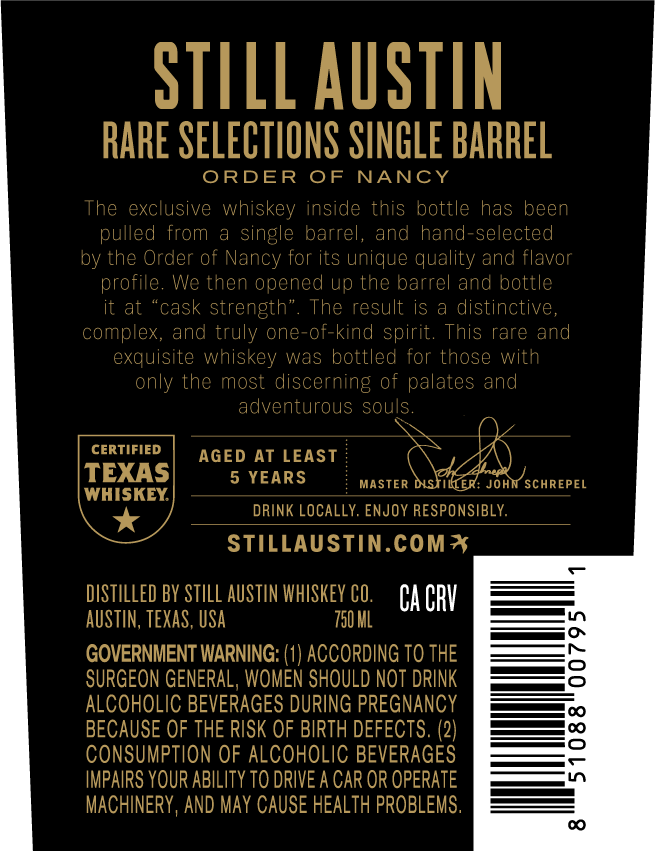
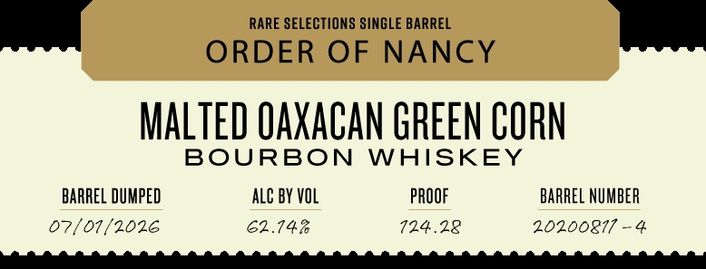

# TTB COLA Label Images - TTBID 26182001000233

**Brand Name:** STILL AUSTIN

**Fanciful Name:** ORDER OF NANCY

**Issue Date:** 07/06/2026

**Origin Code:** 44

**Product Class/Type:** 141

**Source:** [TTB Public COLA Registry](https://ttbonline.gov/colasonline/viewColaDetails.do?action=publicFormDisplay&ttbid=26182001000233)

## Label Images

### Back Label

### Front Label

### Label 4

## Extracted Label Text

*Text extracted via OCR - may contain errors*

**Detected Age:** 5 Years

### Back Label

STILL AUSTIN
RARE SELECTIONS SINGLE BARREL
ORDER
OF
NANCY
The exclusive whiskey inside this bottle has been
pulled from
single
barrel,
and hand-selected
by the Order of Nancy for its unique quality and flavor
profile.
Wc then opened up thc barrel and bottle
it at
cask strength"
The result is
distinctive,
complex, and truly one-of-kind spirit. This rare and
exquisite whiskey was bottled for those with
only the most discerning of palates and
adventurous souls:
CERTIFIED
AGED AT LEAST
TEXAS
5 YEARS
MASTER DISTILER: John SCHREPEL
WHISKEY
DRINK LOCALLY: ENJOY RESPONSIBLY:
STILLAUSTIN.coM*
diStILLeD BY StILL AUSTIN WhISKEV CO.
Ca CRV
AUSTIN, teXAS, USA
750 HL
GOVERNMENT WARNING: (1) ACCORDING TO THE
SURGEON GENERAL, WOMEN SHOULD NOT DRINK
ALCOHOLIC BEVERAGES DURING PREGNANCY
BECAUSE OF THE RISK OF BIRTH DEFECTS: (2)
ConsumptiON OF ALCOHOLIC BEVERAGES
IMPAIRS YOUR ABILITY TO DRIVE A CAR OR OPERATE
MACHINERY , AND May CAUSE HEALTH PROBLEMS.

### Front Label

RARE SELECTIONS SINGLE BARREL
—_ ORDER OF NANCY =
MALTED QAXACAN GREEN CORN
BOURBON WHISKEY
BARREL DUMPED ALC BY VOL PROOF BARREL NUMBER
07/01/2026 62.14% 724.28 20200817 -4
PM RTE SET LMI SET NER ORT MMT ee MM Ree

### Label 4

SINGLE BARREL CASK STRENGTH | > HLONAYLS WSVO 17NUVE JTINIS

a
