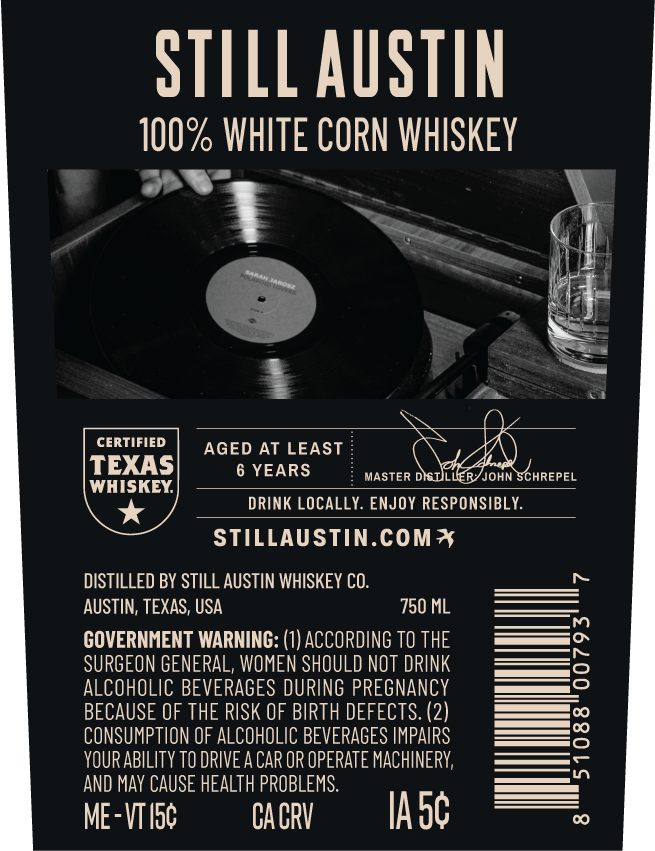
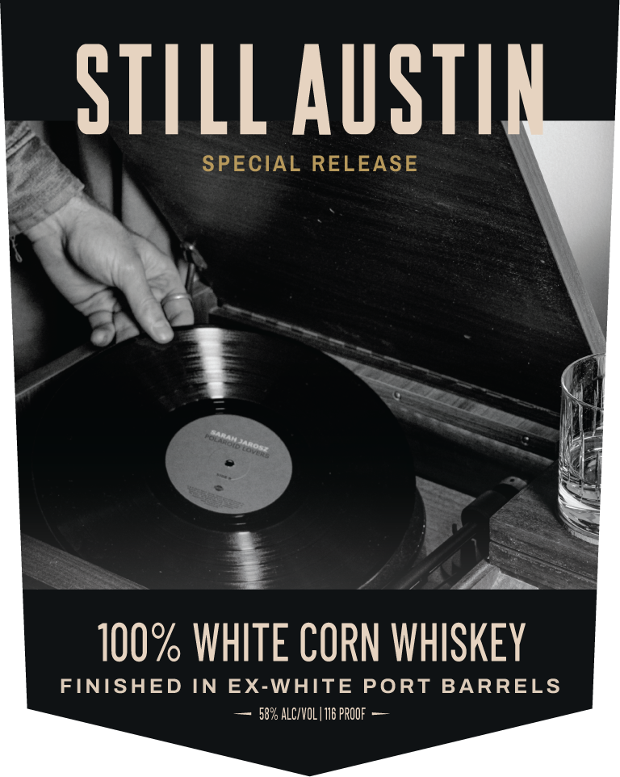

# TTB COLA Label Images - TTBID 26182001000279

**Brand Name:** STILL AUSTIN

**Fanciful Name:** SPECIAL RELEASE

**Issue Date:** 07/06/2026

**Origin Code:** 44

**Product Class/Type:** 143

**Source:** [TTB Public COLA Registry](https://ttbonline.gov/colasonline/viewColaDetails.do?action=publicFormDisplay&ttbid=26182001000279)

## Label Images

### Back Label

### Front Label

### Label 3

## Extracted Label Text

*Text extracted via OCR - may contain errors*

**Detected Proof:** 116
**Detected Age:** 6 Years

### Back Label

STILL AUSTIN
100% WHITE CORN WHISKEY
CERTIFIED
AGED AT LEAST
TEXAS
6 YEARS
MASTER DISULLERYJOHN SCHREPEL
WHISKEY
DRINK LOCALLY. ENJOY RESPONSIBLY:
STILLAUSTIN.COM*
DISTILLED BY STILL AUSTIN WHISKEY CO:
AUSTIN; TEXAS; USA
750 ML
GOVERNMENT WARNING: (1) ACCORDING TO THE
SURGEON GENERAL, WOMEN SHOULD NOT DRINK
ALCOHOLIC BEVERAGES DURING PREGNANCY
BECAUSE OF THE RISK OF BIRTH DEFECTS: (2)
CONSUMPTION OF ALCOHOLIC BEVERAGES IMPAIRS
2
YOUR ABILITy TO DRIVE A CAR OR OPERATE MACHINERV;
AND MaY CAUSE HEALTH PROBLEMS:
ME-VTIsc
CA CRV
IAsc

### Front Label

STILL AuSTN
SPECIAL RELEASE
100% WHITE CORN WHISKEY
FINISHED IN
EX-WHITE
PORT
BARRELS
58% ALCIVOL | 116 pROOF
Hamtn

### Label 3

100% TEXAS GROWN GRAINS

SNIVYS NMOUS SVXIL ZOOL

ad
