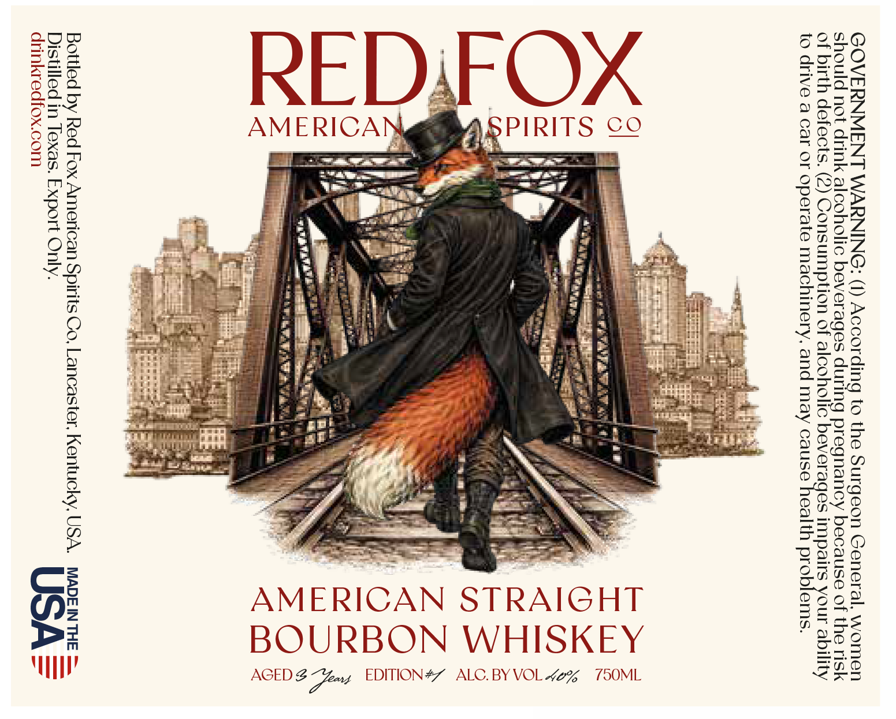

# TTB COLA Label Images - TTBID 26182001000343

**Brand Name:** RED FOX

**Issue Date:** 07/17/2026

**Origin Code:** 22

**Product Class/Type:** 101

**Source:** [TTB Public COLA Registry](https://ttbonline.gov/colasonline/viewColaDetails.do?action=publicFormDisplay&ttbid=26182001000343)

## Label Images

### Label 1

## Extracted Label Text

*Text extracted via OCR - may contain errors*

### Label 1

GOVERNMENT WARNING: (1) According to the Surgeon General, women
should not drink alcoholic beverages during pregnancy because of the risk
of birth defects. (2) Consumption of alcoholic beverages impairs your ability
to drive a car or operate machinery, and may cause health problems.

AGED 3 Yous EDITION#” ALC.BY VOL ~% 750ML

AMERICAN STRAIGHT
BOURBON WHISKEY

Bottled by Red Fox American Spirits Co, Lancaster, Kentucky, USA. MADEIN THE
Distilled in Texas. Export Only. US A
drinkredfox.com
