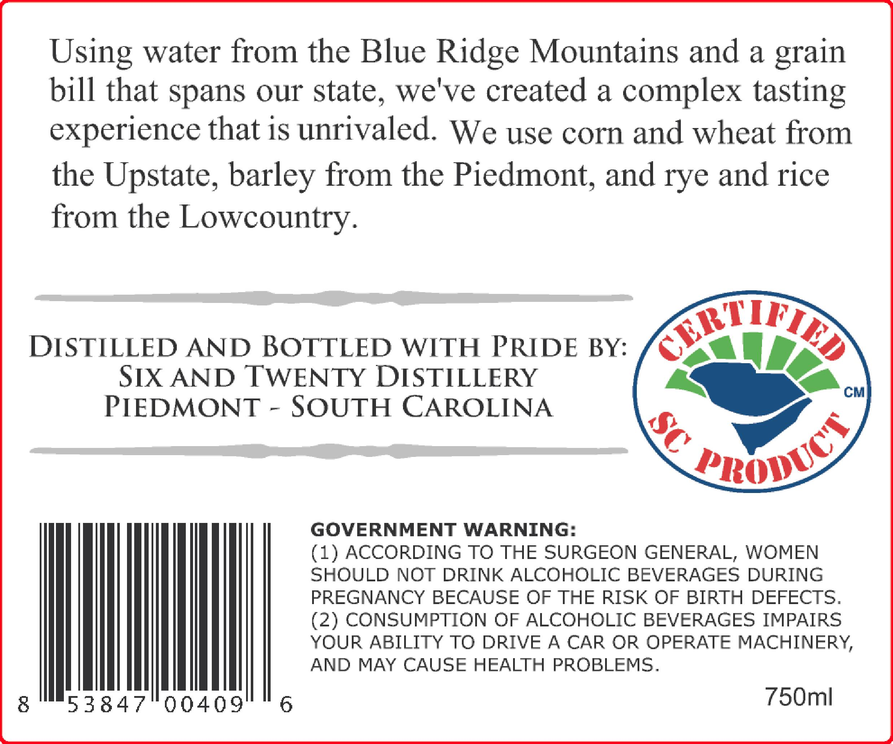
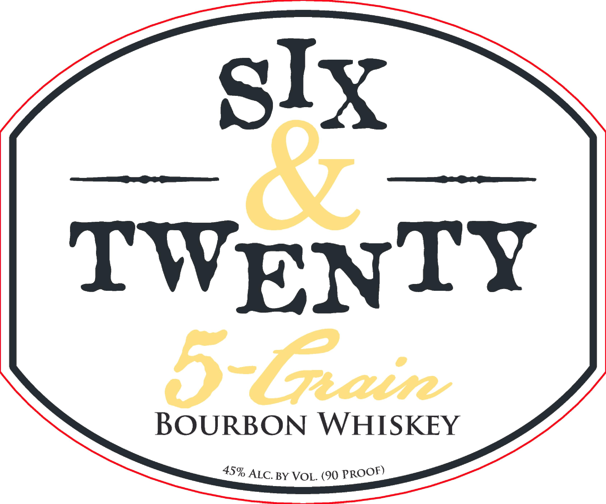

# TTB COLA Label Images - TTBID 26182001000605

**Brand Name:** SIX AND TWENTY

**Fanciful Name:** FIVE GRAIN BOURBON

**Issue Date:** 07/06/2026

**Origin Code:** 41

**Product Class/Type:** 141

**Source:** [TTB Public COLA Registry](https://ttbonline.gov/colasonline/viewColaDetails.do?action=publicFormDisplay&ttbid=26182001000605)

## Label Images

### Back Label

### Label 1

## Extracted Label Text

*Text extracted via OCR - may contain errors*

*1 image(s) excluded: text did not meet readability threshold*

### Back Label

Using water from the Blue Ridge Mountains and a
bill that spans our state
7
we've created a
complex tasting
experience that is unrivaled
We use corn and wheat from
the Upstate, barley from the Piedmont, and rye and rice
from the Lowcountry.
DISTILLED AND BOTTLED WITH PRIDE BY:
&F
SIX AND TWENTY DISTILLERY
CM
PIEDMONT
SOUTH CAROLINA
GOVERNMENT WARNING:
(1) ACCORDING TO THE SURGEON GENERAL, WOMEN
SHOULD NOT DRINK ALCOHOLIC BEVERAGES DURING
PREGNANCY BECAUSE OF THE RISK OF BIRTH DEFECTS,
(2) CONSUMPTION OF ALCOHOLIC BEVERAGES IMPAIRS
YOUR ABILITY TO DRIVE A CAR OR OPERATE MACHINERY,
AND MAY CAUSE HEALTH PROBLEMS.
8
53847
00409
6
750ml
grain
8
RBOnUCS
