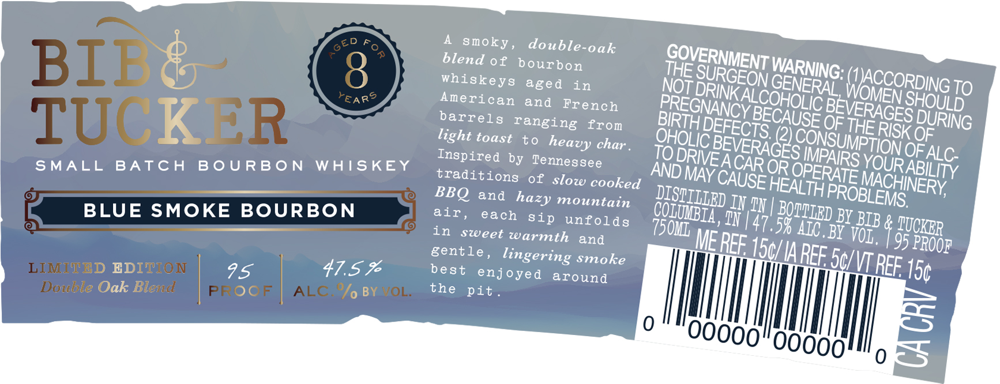

# TTB COLA Label Images - TTBID 26182001000669

**Brand Name:** BIB & TUCKER

**Issue Date:** 07/07/2026

**Origin Code:** 43

**Product Class/Type:** 141

**Source:** [TTB Public COLA Registry](https://ttbonline.gov/colasonline/viewColaDetails.do?action=publicFormDisplay&ttbid=26182001000669)

## Label Images

### Back Label

### Front Label

## Extracted Label Text

*Text extracted via OCR - may contain errors*

**Detected Proof:** 95

### Back Label

PROUDLY 4
MADE IN LIMITED EDITION

Tenne.
SSee Double Oak Blend

### Front Label

Fo
double-oak
BIB
blend of bourbon
8
whiskeys
aged
in
'DRINK /
TO
YEARS
American
and
French
TUCKER
barrels ranging
from
OF
KSSOURING
light toast
t0
char
(2)
OF
Inspired by Tennessee
TO
A
OF ,
SMALL
BATC H
B 0 U RBO N
WAISKEY
OR
traditions
of
slow cooked
MAY
BBQ
and
mountain
IN TN
BLUE
SMOKE BOURBON
air
each
sip
unfolds
TN [47,
BY BIB &
in
swveet warmth
7508L
58 Aic Bi VoLB
TUCKBR
and
MEREF
95
gentle
lingering smoke
IREESNVREF;
LIMITBD BEDITION
95
47.5 %
best
enjoyed
around
I5c
Double Oak Blevd
PR O0F
ALC, %/ BYMOL.
the
pit
GED
smoky ,
GOVERNMENT
WARNING: [
THE
SURGEON
(TJACCORDING
GENERAL
NOT
WOMEN '
ALCOHOLIC
SHOULD
PREGNANCY E
BEVERAGES
BECAUSE
BIRTHI
DEFECTS:
THE
OHOLIC
CONSUMPTION
heavy
BEVERAGES
ALC
DRIVE;
IMPAIRS
YOURI
CARL
ABILITY
AND
OPERATE
CAUSE
MACHINERY;
HEALTHI
PROBLEMS:
DISTILIED
hazy
BOTTIED _
COLUMBIA ,
PROOF
150/
E
