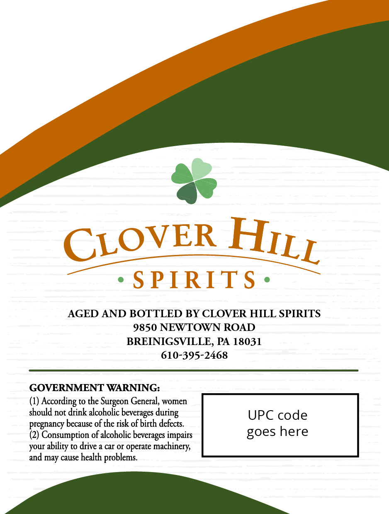
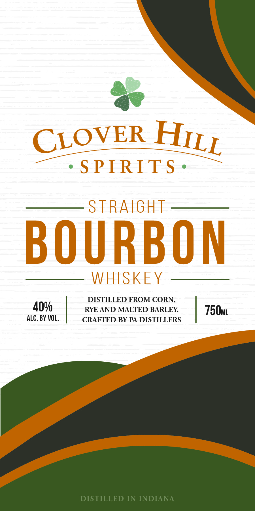

# TTB COLA Label Images - TTBID 26182001000671

**Brand Name:** CLOVER HILL SPIRITS

**Issue Date:** 07/24/2026

**Origin Code:** 39

**Product Class/Type:** 101

**Source:** [TTB Public COLA Registry](https://ttbonline.gov/colasonline/viewColaDetails.do?action=publicFormDisplay&ttbid=26182001000671)

## Label Images

### Back Label

### Front Label

## Extracted Label Text

*Text extracted via OCR - may contain errors*

### Back Label

AGED AND BOTTLED BY CLOVER HILL SPIRITS

9850 NEWTOWN ROAD

BREINIGSVILLE, PA 18031

610-395-2468

GOVERNMENT WARNING:

(1) According to the Surgeon General, women

should not drink alcoholic beverages during

UPC code

pregnancy because of the risk of birth defects.

(2) Consumption of alcoholic beverages impairs

goes here

your ability to drive a car or operate machinery,

and may cause health problems.

### Front Label

CLOVER
S PIRITS
STRAIGHT
BOURBON
WHISKEY
DISTILLED IN INDIANA
HILL
