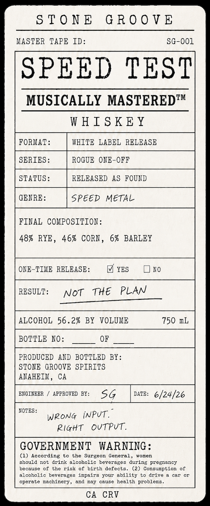

# TTB COLA Label Images - TTBID 26182001000877

**Brand Name:** STONE GROOVE

**Issue Date:** 07/07/2026

**Origin Code:** 01

**Product Class/Type:** 140

**Source:** [TTB Public COLA Registry](https://ttbonline.gov/colasonline/viewColaDetails.do?action=publicFormDisplay&ttbid=26182001000877)

## Label Images

### Label 1

## Extracted Label Text

*Text extracted via OCR - may contain errors*

**Detected Proof:** 112.4

### Label 1

S T 0 N E
G R 0 0 V E
XASTER TAPE ID:
SG-001
SPEED TEST
MUSICALLY MASTEREDTM
W HI S KEY
FORMAT
WHITE LABEL  RELEASE
SERIES:
ROGUE  ONE-OFF
STATUS :
RELEASED AS  FOUND
GENRE:
Speed
METAL
FINAL COKPOSITION:
483
463 CORN _
61  BARLEY
ONE-TIME RELEASE:
YES
BO
RESULT:
Not
Tke
PLAN
ALCOHOL
56.2%
BY
VOLUME
750 IL
BOTTLE NO:
OF
PRODUCED
AND BOTTLED BY:
STONE  GROOVE SPIRITS
ANAHEIM ,
CA
EXCIXEER
APPROVED BF:
Sg
DATz:
6/24/26
NOTES
WRonG  iNPut .
Rigtt
OVTPuT .
GOVERNMENT
WARNING :
According
the
Surgecr General
7omen
ghould not
drink alcohclic
bevereges
during
pregnancy
because cf
the
risk of
birth
defects_
(2)
Consumption
alccholic beverages impairs
Tour
ability
drive
car
operate
cachinery
and
Eay
cause
health problecs
CA
CRV
RYE ,
