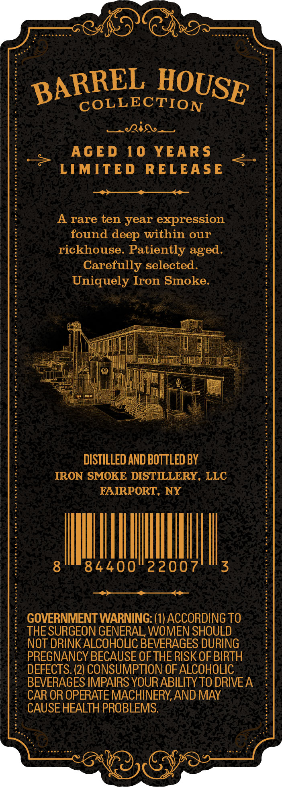
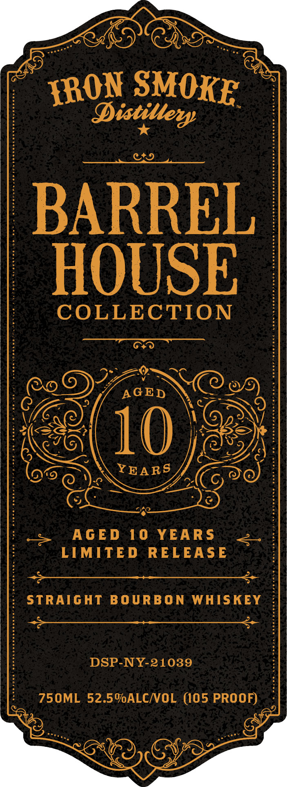
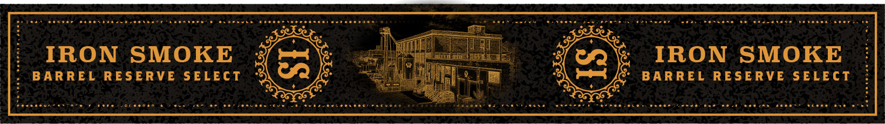

# TTB COLA Label Images - TTBID 26183001000046

**Brand Name:** IRON SMOKE DISTILLERY

**Fanciful Name:** AGED 10 YEARS

**Issue Date:** 07/07/2026

**Origin Code:** 02

**Product Class/Type:** 101

**Source:** [TTB Public COLA Registry](https://ttbonline.gov/colasonline/viewColaDetails.do?action=publicFormDisplay&ttbid=26183001000046)

## Label Images

### Back Label

### Label 1

### Label 3

## Extracted Label Text

*Text extracted via OCR - may contain errors*

**Detected Proof:** 105
**Detected Age:** 10 Years

### Back Label

COLLECTION
Ria
AGED
10
YEAR $
LIMITED
RELEASE
A
rare ten year
expression
found
within our
rickhouse. Patiently
Carefully selected:
Uniquely Iron Smoke.
DISTILLED AND BOTTLED BY
IRON SMOKE DISTILLERY, LLC
FAIRPORT, NY
84400
22007
3
GOVERNMENT WARNING: (1) ACCORDING TO
THE SURGEON GENERAL, WOMEN SHOULD
NOT DRINKALCOHOLC BEVERAGES DURING
PREGNANCY BECAUSE OF THE RISK OF BIRTH
DEFECTS. (2) CONSUMPTION OF ALCOHOLIC
BEVERAGES IMPAIRS YOUR ABILITY TO DRIVEA
CAR OR OPERATE MACHINERY,AND MAY
CAUSE HEALTH PROBLEMS:
BARREL
HOUSE
deep
aged.

### Label 1

Distilleng
"9
BARREL
HOUSE
COLLECTION
AGED
10
YEARS
AGED
10
YEAR S
LIMITED
RELEASE
STRAIGHT
BO URB O N
WHISKEY
DSP-NY-21039
750ML 52.50ALCNOL (105 PROOF)
SMOKE
FRON

### Label 3

IRON
SMOKE
5
2
IRON
SMOKE
BAR REL RESERVE SELECT
BAR REL RESERVE SELECT
