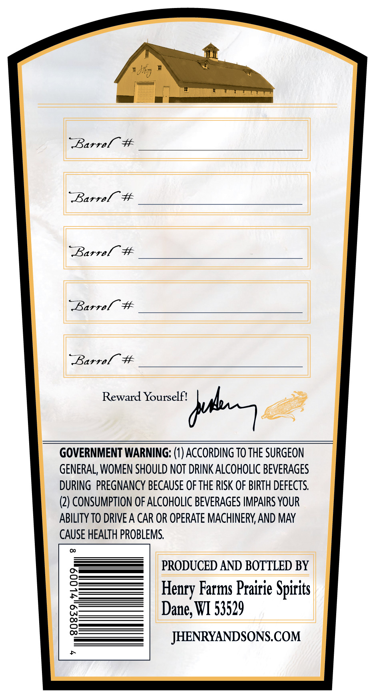
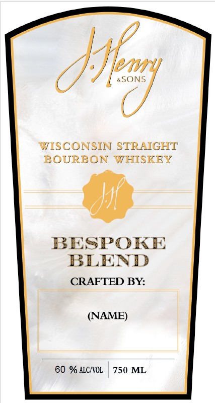

# TTB COLA Label Images - TTBID 26183001000057

**Brand Name:** J. HENRY & SONS

**Fanciful Name:** BESPOKE BLEND

**Issue Date:** 08/07/2026

**Origin Code:** 48

**Product Class/Type:** 101

**Source:** [TTB Public COLA Registry](https://ttbonline.gov/colasonline/viewColaDetails.do?action=publicFormDisplay&ttbid=26183001000057)

## Label Images

### Back Label

### Front Label

## Extracted Label Text

*Text extracted via OCR - may contain errors*

**Detected Proof:** 120

### Back Label

Barrel #
Barrel #
Barrel  #
Barrel #
RBarrel
#
Reward Yourselfi
dul7
GOVERNMENT WARNING: (1) ACCORDING TO THE SURGEON
GENERAL, WOMEN SHOULD NOT DRINK ALCOHOLIC BEVERAGES
DURING   PREGNANCY BECAUSE OF THE RISK OF BIRTH DEFECTS:
(2) CONSUMPTION OF ALCOHOLIC BEVERAGES IMPAIRS YOUR
ABILITY TO DRIVE A CAR OR OPERATE MACHINERY AND MAY
CAUSE HEALTH PROBLEMS
PRODUCED AND BOTTLED BY
8
Farms Prairie Spirits
Dane; WI 53529
8
JHENRYANDSONS.COM
Hency_

### Front Label

}s
xSONS
FISCONSIN STRHIGHT
BOUREON
YTHISKEY
BESPOKE
BLEND
CRAFTED BY:
(NAME)
60 % ALC/VOL
750 ML
