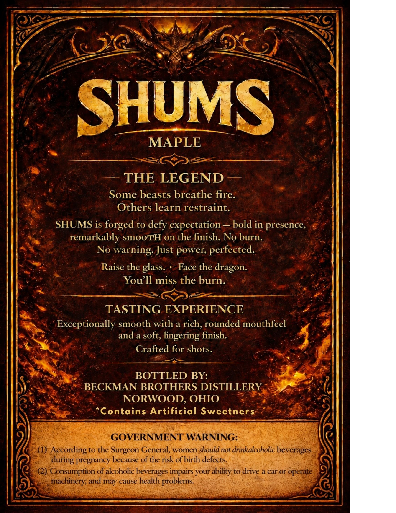
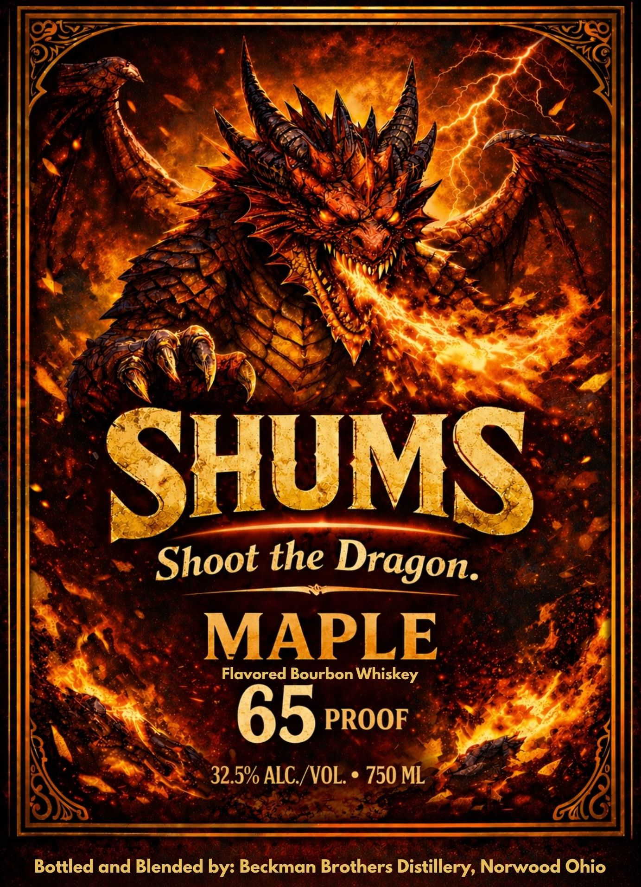

# TTB COLA Label Images - TTBID 26183001000072

**Brand Name:** SHUMS

**Fanciful Name:** MAPLE FLAVORED BOURBON WHISKEY

**Issue Date:** 07/17/2026

**Origin Code:** 09

**Product Class/Type:** 149

**Source:** [TTB Public COLA Registry](https://ttbonline.gov/colasonline/viewColaDetails.do?action=publicFormDisplay&ttbid=26183001000072)

## Label Images

### Back Label

### Front Label

## Extracted Label Text

*Text extracted via OCR - may contain errors*

**Detected Proof:** 130

### Back Label

6)
SHUMS
MAPLE
THE LEGEND
Some beasts breathe fire:
Others learn restraint.
SHUMS is forged to defy expectation
bold in presence;
remarkably SmooTH On the finish: No burn:
No
warning Just power; perfected.
Raise the glass.
Face the dragon:
You ]l miss the burn.
TASTING EXPERIENCE
Exceptionally smooth with a rich, rounded mouthfeel
and a soft, lingering finish.
Crafted for shots.
BOTTLED BY:
BECKMAN BROTHERS DISTILLERY
NORWOOD, OHIO
Contains Artificial
Sweetners
GOVERNMENT WARNING:
(1)
According to the Surgeon General, women shouldnot drinkalcoholic beverages
pregnancy because of the risk ofbirth defects
Consumption of alcoholic beverages impairs your
to drive a car or operate
machinery; and may cause health problems:
during
ability

### Front Label

SHUMS
Shoot the
MAPLE
Flavored Bourbon Whiskey
65
PROOF
32.5% ALC / VOL:
750 ML
Bottled and Blended by: Beckman Brothers Distillery, Norwood Ohio
Dragon.
