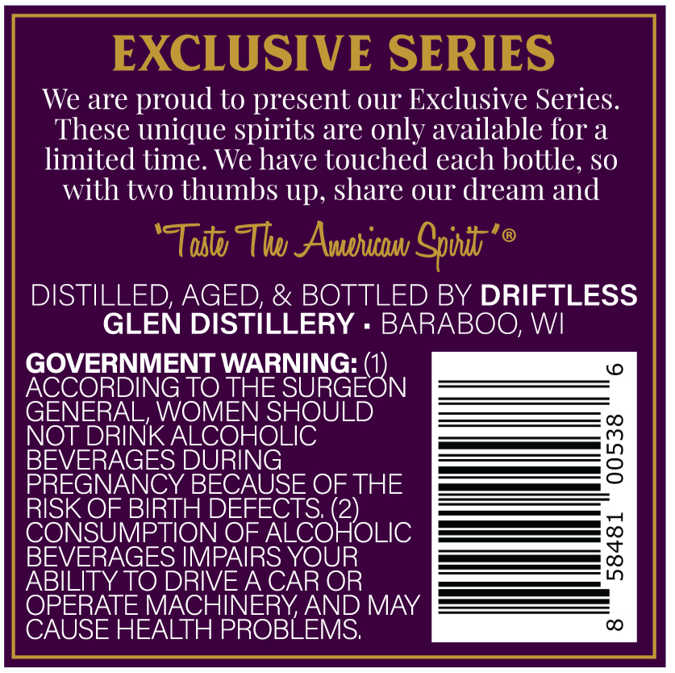
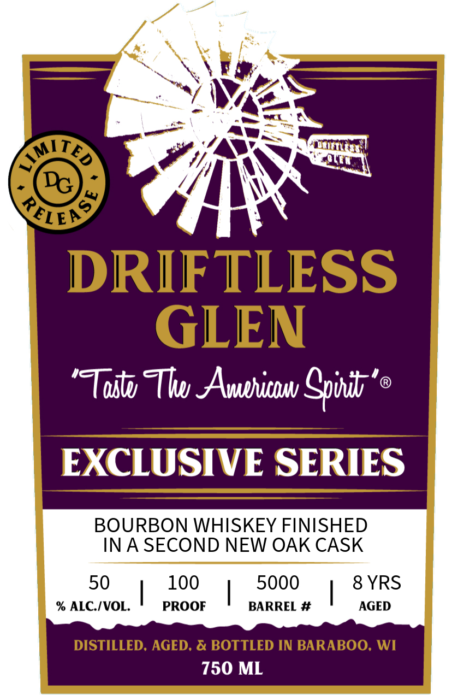

# TTB COLA Label Images - TTBID 26183001000198

**Brand Name:** DRIFTLESS GLEN

**Issue Date:** 07/07/2026

**Origin Code:** 48

**Product Class/Type:** 141

**Source:** [TTB Public COLA Registry](https://ttbonline.gov/colasonline/viewColaDetails.do?action=publicFormDisplay&ttbid=26183001000198)

## Label Images

### Back Label

### Front Label

## Extracted Label Text

*Text extracted via OCR - may contain errors*

**Detected Age:** 8 Years

### Back Label

EXCLUSIVE SERIES
We are proud to present our Exclusive Series:
These unique spirits are only available for a
limited time. We have touched each bottle, so
with two thumbs Up, share our dream and
'Todtu Tlw AAvphitduw Cpudb'
@
DISTILLED; AGED, & BOTTLED BY DRIFTLESS
GLEN DISTILLERY
BARABOO, WI
GOVERNMENT WARNING: (1)
0
ACCORDING TO THE SURGEON
GENERAL, WOMEN SHOULD
NOT DRINK ALCOHOLIC
BEVERAGES DURING
3
PREGNANCY BECAUSE OF THE
RISK OF BIRTH DEFECTS: (2)
CONSUMPTION OF ALCOHOLIC
BEVERAGES IMPAIRS YOUR
8
ABILITY TO DRIVEA CAR OR
OPERATE MACHINERYAND MAY
CAUSE HEALTH PROBLEMS;
CO

### Front Label

6
Y
DRIFTLESS
GLEN
'Tustu Thwu AAvhitnu Cpwnibv'
EXCLUSIVE SERIES
BOURBON WHISKEY FINISHED
INA SECOND NEW OAK CASK
50
100
5000
8 YRS
% ALC IVOL.
PROOF
BARREL #
AGED
DISTILLED. AGED; & BOTTLED IN BARABOO; WI
750 ML
LMI_
TED
RELey
