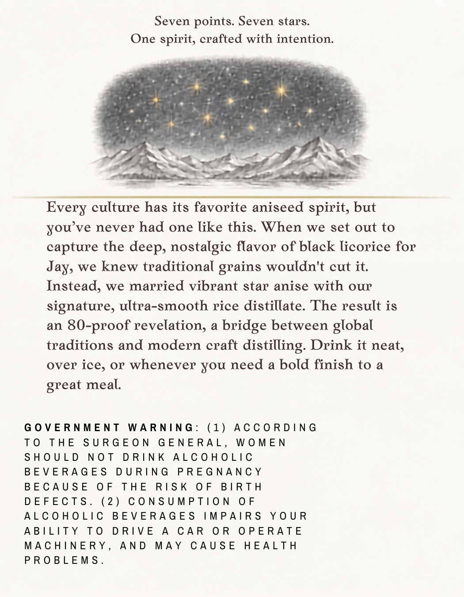
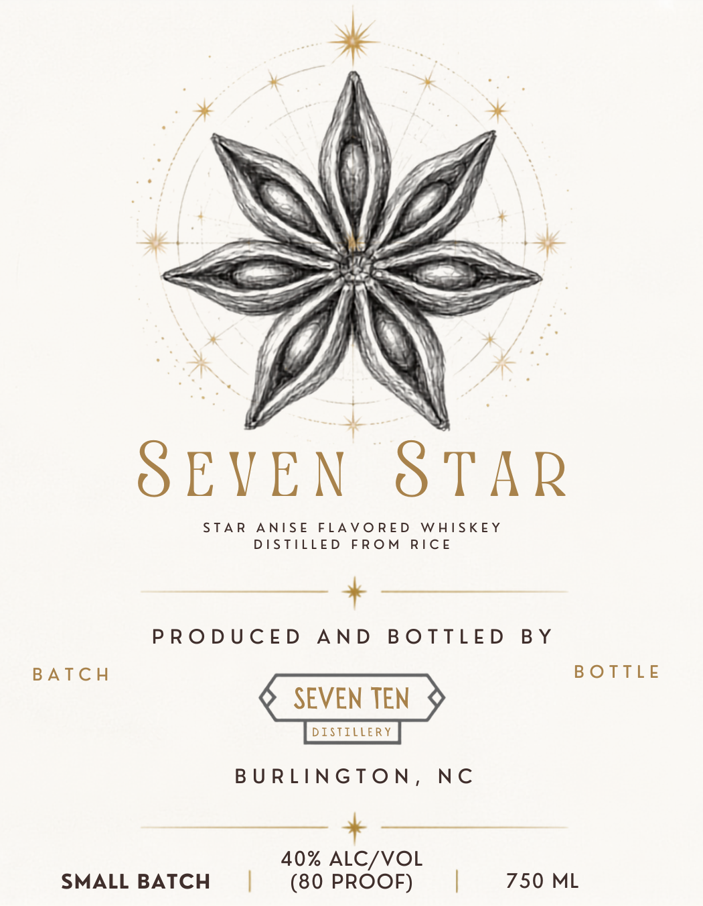

# TTB COLA Label Images - TTBID 26183001000287

**Brand Name:** SEVEN TEN DISTILLERY

**Fanciful Name:** SEVEN STAR

**Issue Date:** 07/09/2026

**Origin Code:** 35

**Product Class/Type:** 149

**Source:** [TTB Public COLA Registry](https://ttbonline.gov/colasonline/viewColaDetails.do?action=publicFormDisplay&ttbid=26183001000287)

## Label Images

### Back Label

### Front Label

## Extracted Label Text

*Text extracted via OCR - may contain errors*

**Detected Proof:** 80

### Back Label

Seven points. Seven stars.
One spirit, crafted with intention.

Every culture has its favorite aniseed spirit, but
you’ve never had one like this. When we set out to
capture the deep, nostalgic flavor of black licorice for
Jay, we knew traditional grains wouldn't cut it.
Instead, we married vibrant star anise with our
signature, ultra-smooth rice distillate. The result is
an 80-proof revelation, a bridge between global
traditions and modern craft distilling. Drink it neat,
over ice, or whenever you need a bold finish to a
great meal.

GOVERNMENT WARNING: (1) ACCORDING
TO THE SURGEON GENERAL, WOMEN
SHOULD NOT DRINK ALCOHOLIC
BEVERAGES DURING PREGNANCY
BECAUSE OF THE RISK OF BIRTH
DEFECTS. (2) CONSUMPTION OF
ALCOHOLIC BEVERAGES IMPAIRS YOUR
ABILITY TO DRIVE A CAR OR OPERATE
MACHINERY, AND MAY CAUSE HEALTH
PROBLEMS.

### Front Label

4 Sic. NS
* 4

STAR ANISE FLAVORED WHISKEY
DISTILLED FROM RICE

+

PRODUCED AND BOTTLED BY
BATCH BOTTLE

Q SEVEN TEN 9

BURLINGTON, NC

40% ALC/VOL
SMALL BATCH | (80 PROOF) | 750 ML
