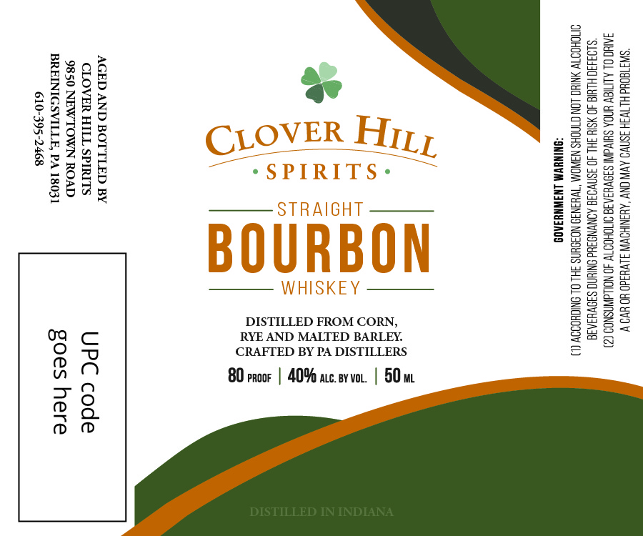

# TTB COLA Label Images - TTBID 26183001000436

**Brand Name:** CLOVER HILL SPIRITS

**Issue Date:** 07/24/2026

**Origin Code:** 39

**Product Class/Type:** 101

**Source:** [TTB Public COLA Registry](https://ttbonline.gov/colasonline/viewColaDetails.do?action=publicFormDisplay&ttbid=26183001000436)

## Label Images

### Front Label

## Extracted Label Text

*Text extracted via OCR - may contain errors*

### Front Label

‘SIA TOUd HLTW3H 3SNVO AVIN ONY ‘AHSNIHOVIN JLVHad0 HO HWO V
INO OL ALITIGV HDA SUV S3OVU3AIE OMOHOIW 40 NOLLdINSNOO (2)
“SL03430 HLWIG 40 SI 3HL 40 3SN'VO38 AONVNO3Hd ONIN S3OVH3AIE
OMIOHOOT ANIC _LON CNCHS NAWOM\ “TWHAN39 NOFOHNS 3HL OL ONIGHODOY (1)
SONINGWM LNAWNYIAOS

DISTILLED FROM CORN,
RYE AND MALTED BARLEY.
CRAFTED BY PA DISTILLERS

80 proor | 40% auc. svvo. | 50m

AGED AND BOTTLED BY
CLOVER HILL SPIRITS UPC code
9850 NEWTOWN ROAD

BREINIGSVILLE, PA 18031 goes here

610-395-2468
