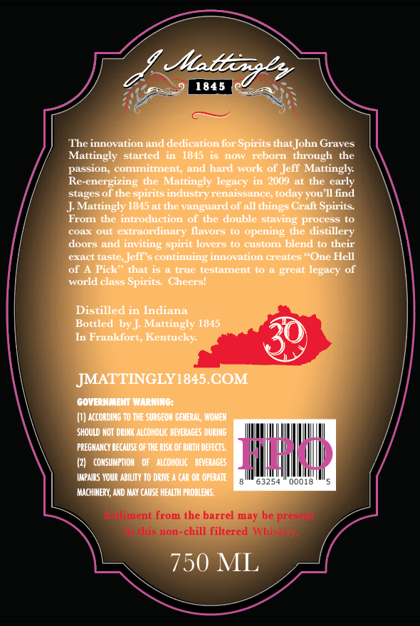
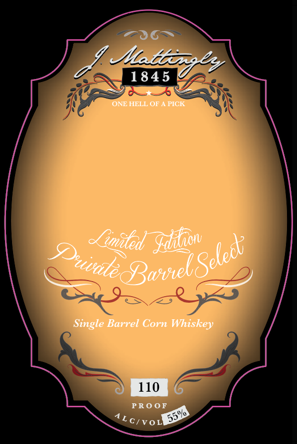

# TTB COLA Label Images - TTBID 26183001000454

**Brand Name:** J.MATTINGLY 1845

**Fanciful Name:** PRIVATE BARREL

**Issue Date:** 07/07/2026

**Origin Code:** 22

**Product Class/Type:** 143

**Source:** [TTB Public COLA Registry](https://ttbonline.gov/colasonline/viewColaDetails.do?action=publicFormDisplay&ttbid=26183001000454)

## Label Images

### Back Label

### Front Label

## Extracted Label Text

*Text extracted via OCR - may contain errors*

**Detected Proof:** 110

### Back Label

Jlta
e
1845
The innovation and dedication for Spirits that John Graves
Mattingly
started
1815
now
reborn through
the
passion, Commitmenty and hard work of Jeff Mattingly
Re-energizing the Mattingly legacy in 2009 at the early
stagesof the spirits industryrenaissance,today you I ind
Mattingly 1845at the vanguard of all things Craft Spirits:
From
the introduction
of the
double staving process to
coax
Olt
extraordinary llavors
opening the distillery
doors and
inviting spirit lovers to custom blend to their
exact taste; Jefles continuing innovation creates "One Hell
Of A Pic"
that 15
true testament to
great
world class Spirits;
Ccheers
Distilled in Indiana
Bottled by ] Mattingly 1845
In Franklort; Kentucky
JMATTINGLY1845,COM
GOVERNMEM WARNING:
(I) ACcording to THE SURGEON GENERAL, WOME
SHOULD NOT DRINK Alcoholic beveRAGES durINg
PREGNANCY because Of The RISK Of BIRTh defects:
CONSUMPTTOM
ALcOHOLIC
BEYERAGES
HHU
MapaIRS VOUR ABILITY TO DRME
CAR OR OPERATE
63254
0001a
MachinerY, AND MaY cauSE HEALTH PROBLEMS:
Sediment from the barrel may be pregertf
nthis non-chill filtered Whiskva
750 ML
legacy

### Front Label

Mdbedv
1845
ONE HELL OF
PICH
~limaled
Single Barrel Corn Whiskey
110
PRO0F
Sdizow
(Bwvel Seledt
Dudlec
55%
ALcivol
