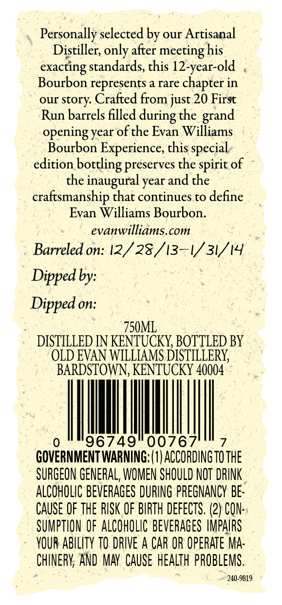

# TTB COLA Label Images - TTBID 26183001000574

**Brand Name:** EVAN WILLIAMS

**Fanciful Name:** FIRST RUN

**Issue Date:** 07/07/2026

**Origin Code:** 22

**Product Class/Type:** 101

**Source:** [TTB Public COLA Registry](https://ttbonline.gov/colasonline/viewColaDetails.do?action=publicFormDisplay&ttbid=26183001000574)

## Label Images

### Back Label

### Label 1

## Extracted Label Text

*Text extracted via OCR - may contain errors*

**Detected Proof:** 113

### Back Label

Personally selected by our Artisanal
Distiller; only after
his
exacting standards, this 12-year-old
Bourbon represents a rare chapter in
our story Crafted from just 20 First
Run barrels filled
the
opening year of the Evan Williams
Bourbon Experience, this
edition
preserves the spirit of
the inaugural year and the
craftsmanship that continues to define
Evan Williams Bourbon:
evanwilliams.com
Barreled on: 12/ 28/13-V 31/14
Dipped by:
Dipped on:
750ML
DISTILLED IN KENTUCKY BOTTLED BY
OLD EVAN WILLIAMS DISTILLERY
BARDSTOWN, KENTUCKY 40004
96749
00767
GOVERNMENT WARNING; (1| ACCORDING TO THE
SURGEON GENERAL, WOMEN SHOULD NOT DRINK
ALCOHOLIC BEVERAGES DURING PREGNANCY BE:
CAUSE OF the RISK OF BIRTH DeFECTS. (2) CON:
SUMPTHON OF ALCOHOLIC beverAgeS IMPAIRS
YOUR ABILITY TO DRIVE A CAR OR OpeRATe MA:
CHINERY AND MAV  CauSe HEALTH pPROBLEMS.
240-9819
meeting
during
grand
special
bottling _

### Label 1

12
Evan
Williams
g32ER1@NcE'
EvanWilliams
KENTUCKY
STRAIGHT BOURBON
WHISKEY
FIRST RUN
56.5% ALC/VOL. (113 PROOF)
240-9725
YEARS
CED
{VITIHIS O
TVNVS)
