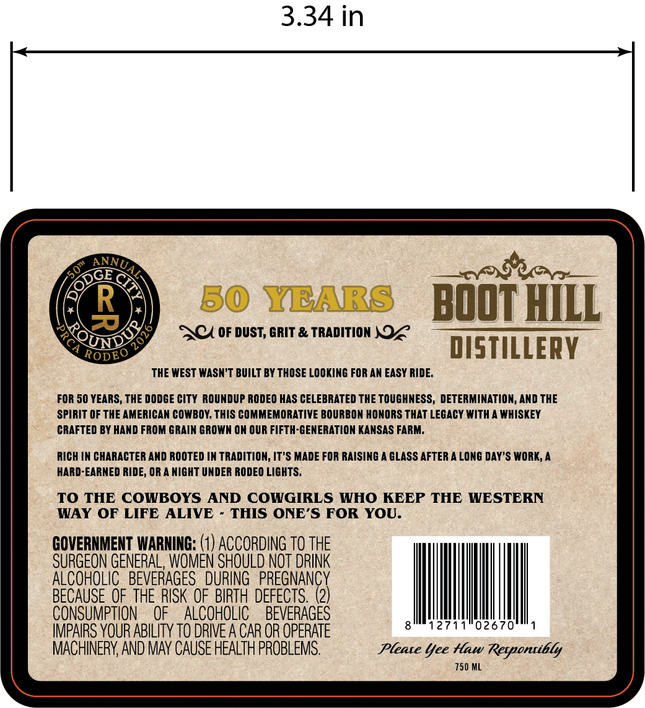
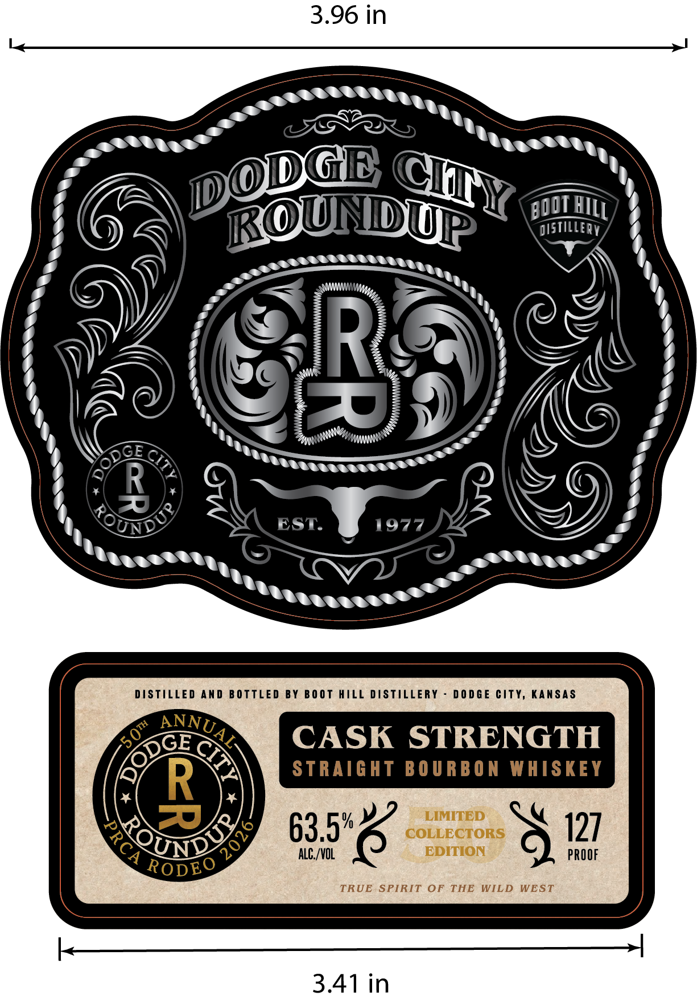

# TTB COLA Label Images - TTBID 26184001000068

**Brand Name:** BOOT HILL DISTILLERY RODEO PRCA RODEO 2026

**Issue Date:** 07/08/2026

**Origin Code:** 21

**Product Class/Type:** 101

**Source:** [TTB Public COLA Registry](https://ttbonline.gov/colasonline/viewColaDetails.do?action=publicFormDisplay&ttbid=26184001000068)

## Label Images

### Back Label

### Label 1

## Extracted Label Text

*Text extracted via OCR - may contain errors*

**Detected Age:** 50 Years

### Back Label

3.34 in
R
50 YEARS
BoOT hmlL
ACA 0F DUST, GRIT & TRADITION NOZ
UNDS
DISTILLERY
RODEO
THE WEST WASN'T BUILT BY THOSE LOOKING FOR AN EASY RIDE.
FOR 50 YEARS, THE DODGE CITY ROUNDUP RODEO HAS CELEBRATED THE TOUCHNESS, DETERMINATION, AND THE
SPIRIT OF THE AMERICAN COWBOy; THIS COMMEMORATIVE BOURBON HONORS THAT LEGACY WITH
WHISKEY
CRAFTED BY HAND FROM GRAIN GROWN ON OUR FIFTH-GENERATION KANSAS FARM_
RICH IN CHARACTER AND ROOTED IN TRADITION, IT'S MADE FOR RAISING
GLASS AFTER A LONG DAY'S WORK,
HARD-EARNED RIDE, OR A NIGHT UNDER RODEO LIGHTS _
TO THE COWBOYS
AND COWGIRLS WHO KEEP THE WESTERN
WAY OF LIFE
ALIVE
THIS ONE'S FOR YOU.
GOVERNMENT WARNING: (1) ACCORDING TO THE
SURGEON GENERAL, WOMEN SHOULD NOT DRINK
ALCOHOLIC  BEVERAGES   DURING   PREGNANCY
BECAUSE OF THE RISK OF BIRTH DEFECTS:
2)
CONSUMPTION
OF
ALCOHOLIC
BEVERAGES
12711"02670
IMPAIRS YOUR ABHLITY TO DRIVE A CAR OR OPERATE
MACHINERY, AND MAv CAUSE HEALTH PROBLEMS.
Pleate Yee Hlaw Rerpontibly
750 ML
ANNUAE
-50m
DGE
3

### Label 1

3.96 in
ROUNDUP
distiLLERV
R
R
7
EST
197
DISTILLEd Anp BOTTLED BY
B0 0t HIll DISTILLERY
D 0 0 GE CitY, Kansas
GE
CASK STRENGTH
STRAIGHT BOURBO N WHSKEEY
R
LIMITED
63.5"-
COLLECTORS
127
QUND
ALC /VOL
EDITION
PROOF
RODEO
TRUE SPIRIT OF
THE WILD
WEST
3.41 in
DODGl
CH
BOL _
HiLL
ToUNo
ANNUAZ
50m
Cr
0
20
