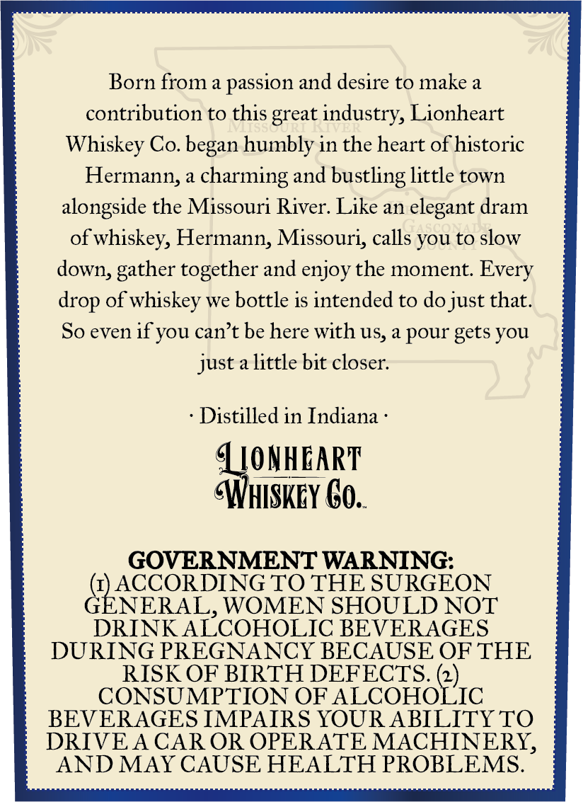
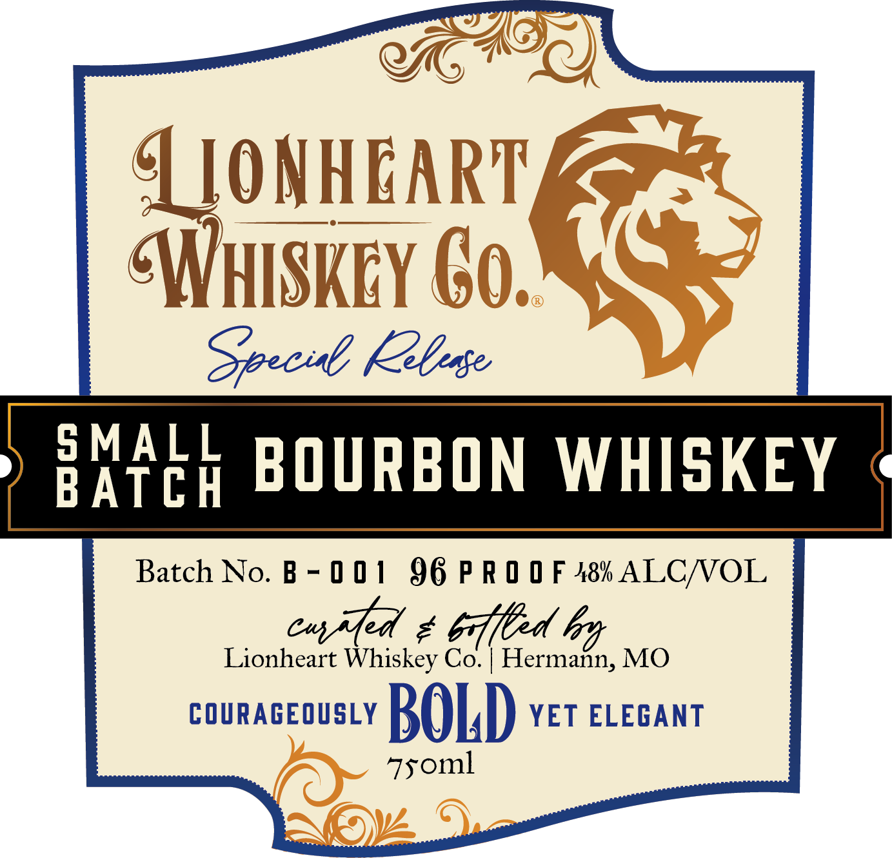

# TTB COLA Label Images - TTBID 26184001000191

**Brand Name:** LIONHEART WHISKEY CO.

**Fanciful Name:** SMALL BATCH BOURBON

**Issue Date:** 07/09/2026

**Origin Code:** 29

**Product Class/Type:** 141

**Source:** [TTB Public COLA Registry](https://ttbonline.gov/colasonline/viewColaDetails.do?action=publicFormDisplay&ttbid=26184001000191)

## Label Images

### Back Label

### Front Label

## Extracted Label Text

*Text extracted via OCR - may contain errors*

### Back Label

Born from a passion and desire to make a
contribution to this great industry, Lionheart
Whiskey Co. began humbly in the heart ofhistoric
Hermann;
charming and bustling little town
alongside the Missouri River: Like an elegant dram
of whiskey, Hermann, Missouri, calls you to slow
down;
together and enjoy the moment: Every
drop of whiskey we bottle is intended to dojust that:
So even if you cant be here with Us, & pour gets you
just a little bit closer:
Distilled in Indiana
QONHEART
Whiskey €o.
GOVERNMENT WARNING:
ACCORDING TO THE SURGEON
GENERAL
WOMEN SHOULD NOT
DRINK ALCOHOLIC BEVERAGES
DURING PREGNANCY BECAUSE OF THE
RISK OF BIRTH DEFECTS. (2)
CONSUMPTION OF ALCOHOLIC
BEVERAGES IMPAIRS YOURABILITY TO
DRIVEA CAR OR OPERATE MACHINERY,
AND MAY CAUSE HEALTH PROBLEMS:
gather

### Front Label

LONHEART
WHISKEY €0.
Specil KIse
S MALL
BATch
BOURBON
WHISKEY
Batch No. B - 0 0 [
96 P R 0 0 F 48 ALCNOL
eva
8
6dfed
Lionheart Whiskey Co.
Hermann, MO
COURAGEOUSLY
BOLD
YET ELEGANT
7soml
Bd
