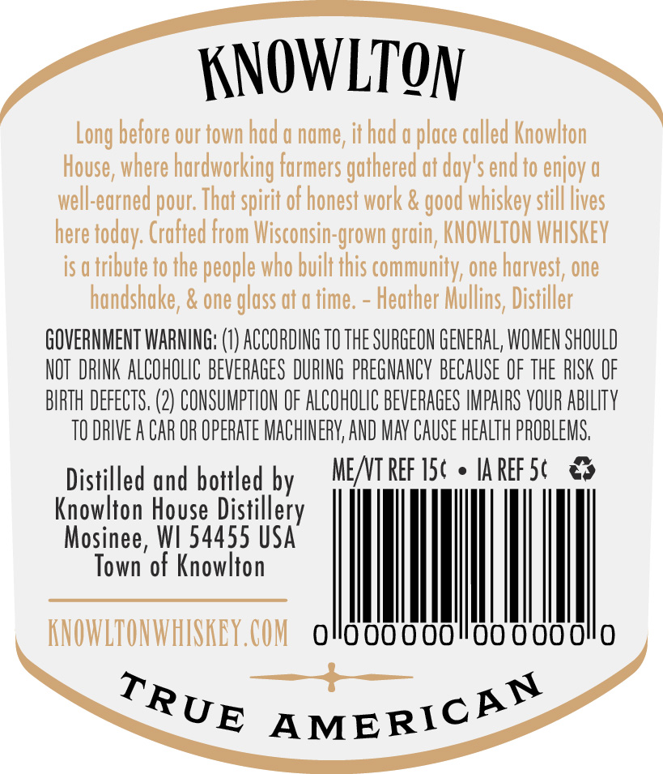
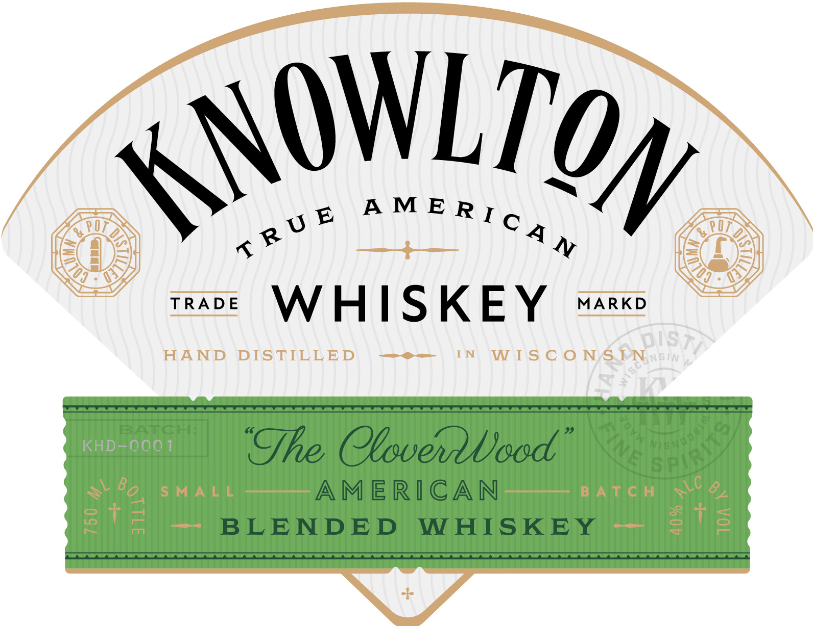
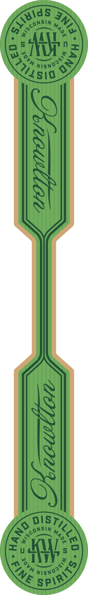

# TTB COLA Label Images - TTBID 26185001000007

**Brand Name:** KNOWLTON

**Issue Date:** 07/15/2026

**Origin Code:** 48

**Product Class/Type:** 137

**Source:** [TTB Public COLA Registry](https://ttbonline.gov/colasonline/viewColaDetails.do?action=publicFormDisplay&ttbid=26185001000007)

## Label Images

### Back Label

### Front Label

### Label 3

## Extracted Label Text

*Text extracted via OCR - may contain errors*

*1 image(s) excluded: text did not meet readability threshold*

### Back Label

KNOWLTON

Long before our town had a name, it had a place called Knowlton

House, where hardworking farmers gathered at day's end to enjoy a

well-earned pour. That spirit of honest work & good whiskey still lives

here today. Crafted from Wisconsin-grown grain, KNOWLTON WHISKEY

is atribute to the people who built this community, one harvest, one

handshake, & one glass at a time

Heather Mullins, Distiller

GOVERNMENT WARNING: (1) ACCORDING TO THE SURGEON GENERAL, WOMEN SHOULD

NOT DRINK ALCOHOLIC BEVERAGES DURING PREGNANCY BECAUSE OF THE RISK OF

BIRTH DEFECTS, (2) CONSUMPTION OF ALCOHOLIC BEVERAGES IMPAIRS YOUR ABILITY

TODRIVEA CAR OR OPERATE MACHINERY, AND MAY CAUSE HEALTH PROBLEMS

Distilled and bottled by

MEAT REF 15¢ © IAREFS¢ &%

Kriewlton House Distillery

Mosinee, WI 54455 USA

Town of Knowlton

Ih

AYOWLTONWHISKEY COM OO G0000"00 0

Rup “americ®™

### Front Label

av® Nee

TRADE IK + | S K EY] MARKD

AMERICAN
BLENDED WHISKEY
