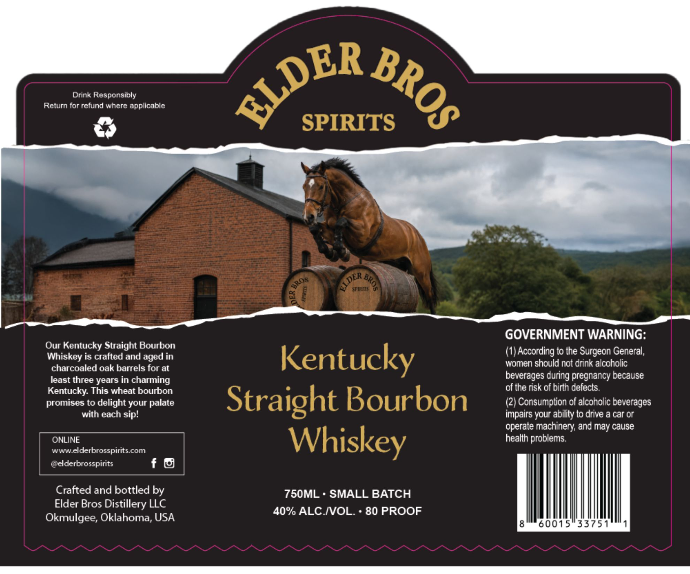

# TTB COLA Label Images - TTBID 26185001000043

**Brand Name:** ELDER BROS SPIRITS

**Issue Date:** 07/08/2026

**Origin Code:** 37

**Product Class/Type:** 101

**Source:** [TTB Public COLA Registry](https://ttbonline.gov/colasonline/viewColaDetails.do?action=publicFormDisplay&ttbid=26185001000043)

## Label Images

### Label 1

## Extracted Label Text

*Text extracted via OCR - may contain errors*

**Detected Proof:** 80

### Label 1

Drink Responsibly
Return for refund where applicable
SPIRITS
eplmhs
GOVERNMENT WARNING:
Our Kentucky Straight Bourbon
Whiskey is crafted and aged in
Kentucky
(1) According to the Surgeon General;
women should not drink alcoholic
charcoaled oak barrels for at
least three years in charming
beverages'
pregnancy because
Kentucky: This wheat bourbon
of the risk of birln defects:
promises to delight your palate
Straight Bourbon
(2) Consumption of alcoholic beverages
with each sip?
impairs your ability to drive a car Cr
operate machinery; and may cause
ONLINE
Whiskey
health problems.
wWWelderbrosspirits com
@elderbrosspirits
f
Crafted and bottled by
750ML * SMALL BATCH
Elder Bros Distillery LLC
40% ALC IVOL.
80 PROOF
Okmulgee; Oklahoma; USA
8
60015
33751
~LDER
BROS
OLDER
2
BROs
1
1
during
