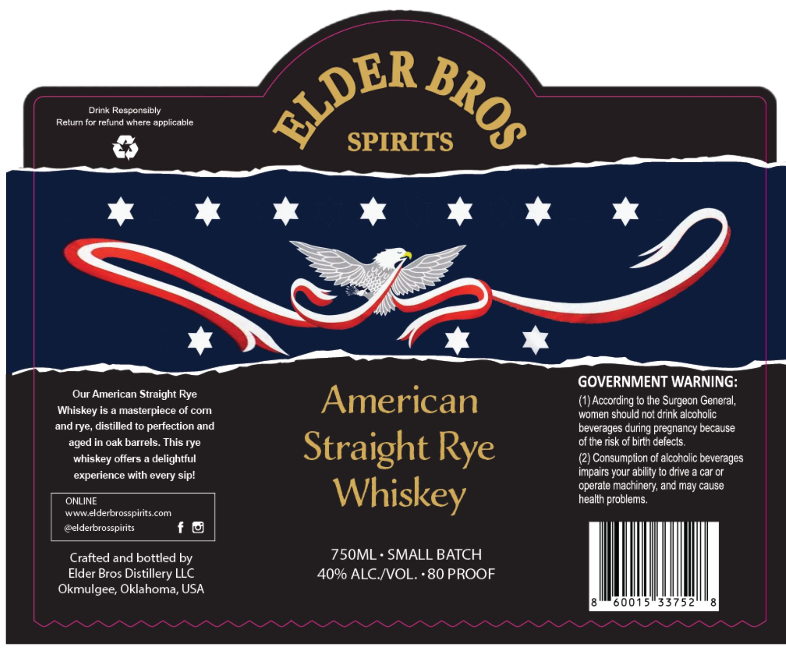

# TTB COLA Label Images - TTBID 26185001000044

**Brand Name:** ELDER BROS SPIRITS

**Issue Date:** 07/07/2026

**Origin Code:** 37

**Product Class/Type:** 102

**Source:** [TTB Public COLA Registry](https://ttbonline.gov/colasonline/viewColaDetails.do?action=publicFormDisplay&ttbid=26185001000044)

## Label Images

### Label 1

## Extracted Label Text

*Text extracted via OCR - may contain errors*

**Detected Proof:** 80

### Label 1

Drink Responsibly
Return for refund where applicable
SPIRITS
GOVERNMENT WARNING:
Our American Straight Rye
American
(1) According to the Surgeon General;,
Whiskey is a masterpiece of corn
women should not drink alcoholic
and rye, distilled to perfection and
beverages during pregnancy because
aged in oak barrels. This rye
of the risk of birth cefects.
whiskey offers a delightful
Straight
(2) Consumption of alcoholic beverages
experience with every sipl
impairs your ability to drive a car or
operate machinery; and may cause
ONLINE
Whiskey
health problems.
wwWelderbrosspiritscom
@elderbrosspirits
Crafted and bottled by
750ML ' SMALL BATCH
Elder Bros Distillery LLC
40% ALC NOL:
80 PROOF
Okmulgee; Oklahoma; USA
8
60015"33752
8
~LDER
BROS
Sy
Rye
