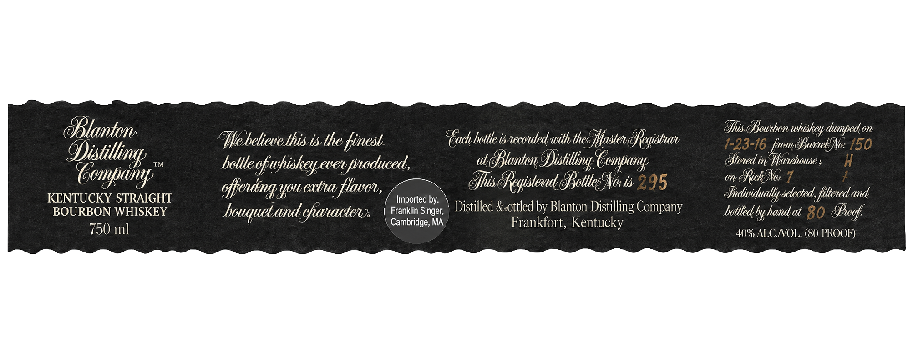
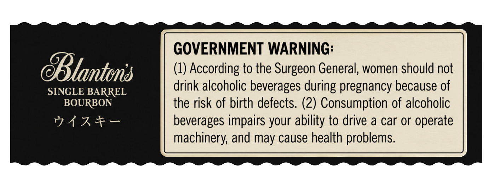

# TTB COLA Label Images - TTBID 26186001000114

**Brand Name:** BLANTON DISTILLING COMPANY

**Issue Date:** 07/08/2026

**Origin Code:** 00

**Product Class/Type:** 101

**Source:** [TTB Public COLA Registry](https://ttbonline.gov/colasonline/viewColaDetails.do?action=publicFormDisplay&ttbid=26186001000114)

## Label Images

### Front Label

### Label 2

## Extracted Label Text

*Text extracted via OCR - may contain errors*

**Detected Proof:** 80

### Front Label

OBtanton
Bhis dcutbon
duped o
Ie betievethis isthe tinest
(ach bottle is tecotded-with thes Masten
voRegishan
1-23-16 fwmdavebANo: 150
IConthuny
TM
bottle cfwhiskeyever pnoduced ,
at  tanton =
Distilling Comfanp
(ftoted i 9Wanehouse ;
K
gffendng yowextna flavov,
Bhis  Registend dottlec No is 295
M11
BRickNos 1
KENTUCKY STRAIGHT
Imported by:
Jndividually setected, fittened and
BOURBON WHISKEY
bouquetand ghanactenx
Franklin Singer;
Distilled & ottled by Blanton Distilling Company
botfled byhandat 80
Sogf
Cambridge; MA
Frankfort, Kentucky
750 ml
40% ALCNOL. (80 PROOF)
whiskey (

### Label 2

GOVERNMENT WARNING:

(1) According to the Surgeon General, women should not

Blanton

SINGLE BARREL

drink alcoholic beverages during pregnancy because of

BOURBON

the risk of birth defects. (2) Consumption of alcoholic

WAAR

beverages impairs your ability to drive a car or operate

machinery, and may cause health problems.
