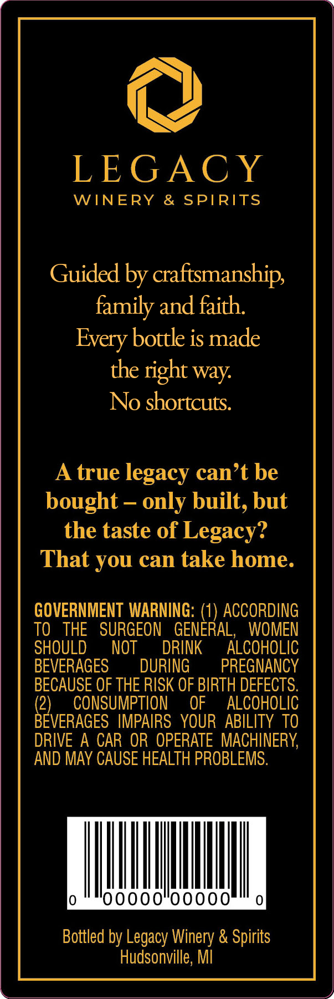
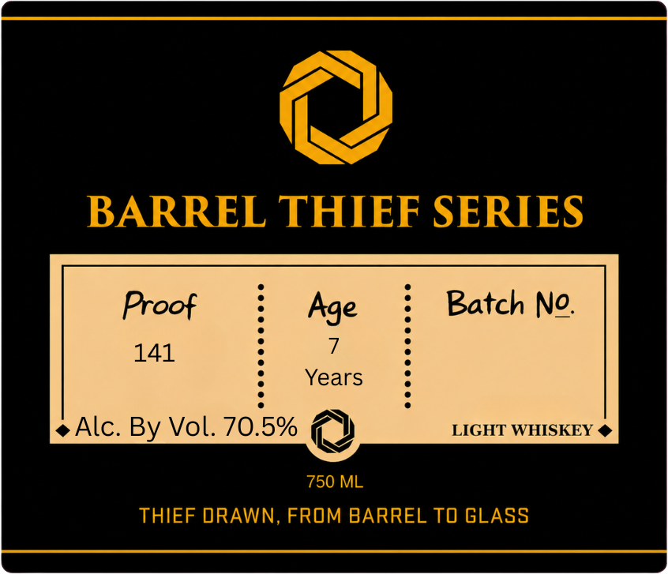

# TTB COLA Label Images - TTBID 26186001000123

**Brand Name:** BARREL THIEF SERIES

**Issue Date:** 07/13/2026

**Origin Code:** 06

**Product Class/Type:** 144

**Source:** [TTB Public COLA Registry](https://ttbonline.gov/colasonline/viewColaDetails.do?action=publicFormDisplay&ttbid=26186001000123)

## Label Images

### Back Label

### Label 1

## Extracted Label Text

*Text extracted via OCR - may contain errors*

### Back Label

LEGACY
WINERY
&
SPIRITS
Guided by craftsmanships
family and faith
bottle is made
the tight way:
No shortcuts:
A true
legacy can't be
bought
4
only built, but
the taste of Legacy?
That you can take home.
GOVERNMENT WARNING:
ACCORDING
TO
THE
SURGEON
GENERAL,
WOMEN
SHOULD
NOT
DRINK
ALCOHOLIC
BEVERAGES
DURING
PREGNANCY
BECAUSE OF THE RISK OF BIRTH DEFECTS:
(2)
CONSUMPTION
OF
ALCOHOLIC
BEVERAGES IMPAIRS   YOUR  ABILITY TO
DRIVE
A CAR OR OPERATE MACHINERY
AND MAY CAUSE HEALTH PROBLEMS.
Bottled by Legacy Winery & Spirits
Hudsonville, MI
Every

### Label 1

BARREL THIEF SERIES
Proof
Age
Batch No
141
Years
Alc:
Vol. 70.5%
LIGHT WHISKEY
750 ML
THIEF DRAWN, FROM BARREL TO GLASS
By
