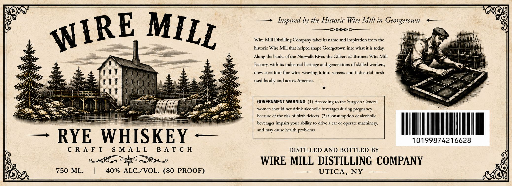

# TTB COLA Label Images - TTBID 26187001000035

**Brand Name:** WIRE MILL

**Issue Date:** 07/07/2026

**Origin Code:** 02

**Product Class/Type:** 142

**Source:** [TTB Public COLA Registry](https://ttbonline.gov/colasonline/viewColaDetails.do?action=publicFormDisplay&ttbid=26187001000035)

## Label Images

### Label 1

## Extracted Label Text

*Text extracted via OCR - may contain errors*

**Detected Proof:** 80

### Label 1

FOr

GH

—> Inspired by the Historic Wire Mill in Georgetown <—

——- DOKOO-—$_—

JRE

MII

Wire Mill Distilling Company takes its name and inspiration from the

oy

sis

historic Wire Mill that helped shape Georgetown into what it is today.

i"

Wi

oe

i

pt

a

Along the banks of the Norwalk River, the Gilbert & Bennett Wire Mill

Na

ion

Factory, with its industrial heritage and generations of skilled workers,

#a

sS

Sis

drew steel into fine wire, weaving it into screens and industrial mesh

bs]

used locally and across America.

tI

°

Se

ery

oa

GOVERNMENT WARNING: (1) According to the Surgeon General,

Ss Em

bell

bed

RP

women should not drink alcoholic beverages durin;

regnanc}

FRR

because of the risk of birch defects. (2) Consumption of alcoholic

pees

a

beverages impairs your ability to drive a car or operate machinery,

and may cause health problems.

ww

a

— RYE WHISKEY —

10199874216628

CRAFT SMALL

BATCH

DISTILLED AND BOTTLED BY

WIRE MILL DISTILLING COMPANY

750 ML.

|

40% ALC./VOL. (80 PROOF)

=P ULICAS NY, 2 —

9

PeKe
