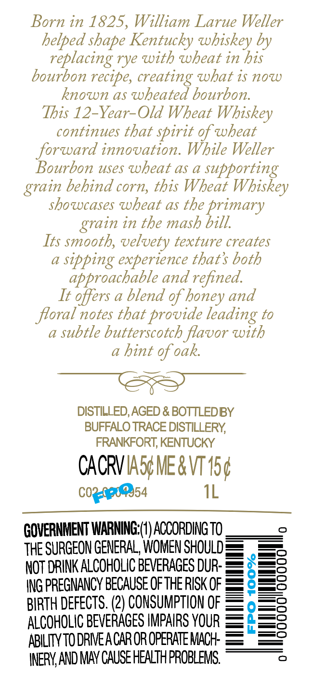
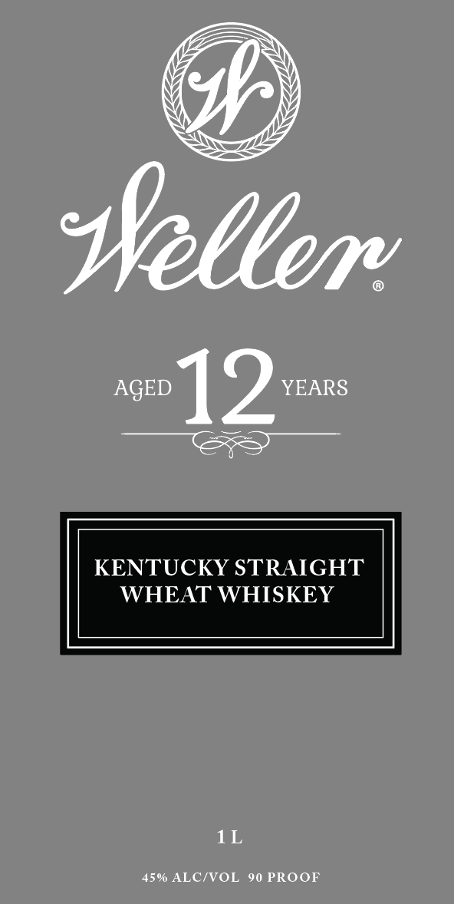

# TTB COLA Label Images - TTBID 26187001000164

**Brand Name:** WELLER

**Issue Date:** 07/07/2026

**Origin Code:** 22

**Product Class/Type:** 109

**Source:** [TTB Public COLA Registry](https://ttbonline.gov/colasonline/viewColaDetails.do?action=publicFormDisplay&ttbid=26187001000164)

## Label Images

### Back Label

### Front Label

## Extracted Label Text

*Text extracted via OCR - may contain errors*

**Detected Proof:** 90
**Detected Age:** 12 Years

### Back Label

Born in 1825, William Larue Weller

helped shape Kentucky whiskey by

replacing rye with wheat in his

bourbon recipe, creating what is now

known as wheated bourbon

This 12-Year-Old Wheat Whiskey

continues that spirit of wheat

forward innovation. While Weller

Bourbon uses wheat as a supporting

grain behind corn, this Wheat Whiskey

showcases wheat as the primary

grain in the mash bill.

Its smooth, velvety texture creates

a sipping experience that’s both

approachable and refined.

It offers a blend of honey and

floral notes that provide leading to

a subtle butterscotch flavor with

a hint of oak

DISTILLED, AGED & BOTTLEDBY

BUFFALO TRACE DISTILLERY,

FRANKFORT, KENTUCKY

CACRVIASG IER VT 15¢

Cogae54

1L

GOVERNMENT WARNING:(1) ACCORDING TO

THE SURGEON GENERAL, WOMEN SHOULD

i=)

=O

NOT DRINK ALCOHOLIC BEVERAGES DUR

=)

—_O

ING PREGNANCY BECAUSE OF THE RISK OF

—is)

BIRTH DEFECTS. (2) CONSUMPTION OF

o=s

ALCOHOLIC BEVERAGES IMPAIRS YOUR ==

StS

SS

ABILITY TO DRIVE A CAR OR OPERATE MACH- = =5

INERY, AND MAY CAUSE HEALTH PROBLEMS.

### Front Label

seller
AGED
12
YEARS
KENTUCKY STRAIGHT
WHEAT WHISKEY
1L
450 ALCIVOL
90 PROOF
