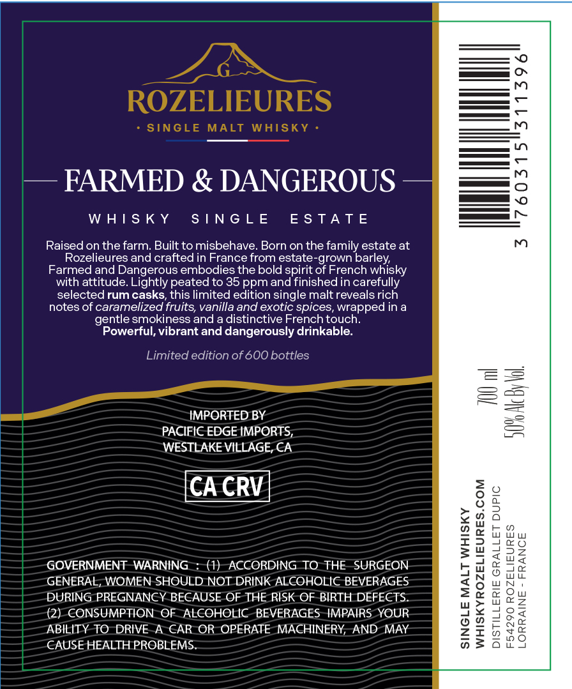
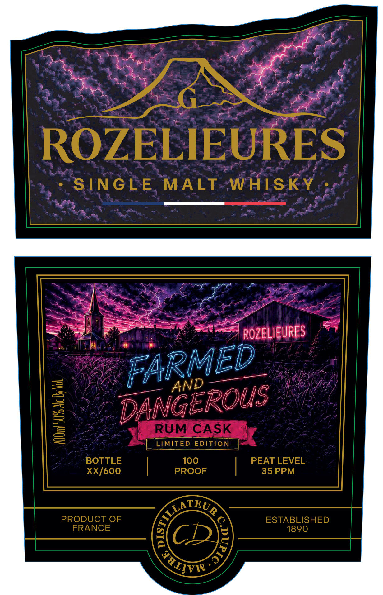

# TTB COLA Label Images - TTBID 26187001000169

**Brand Name:** ROZELIEURES

**Fanciful Name:** FARMED & DANGEROUS

**Issue Date:** 07/08/2026

**Origin Code:** 51

**Product Class/Type:** 118

**Source:** [TTB Public COLA Registry](https://ttbonline.gov/colasonline/viewColaDetails.do?action=publicFormDisplay&ttbid=26187001000169)

## Label Images

### Back Label

### Front Label

## Extracted Label Text

*Text extracted via OCR - may contain errors*

**Detected Proof:** 70

### Back Label

ROZELIEURES
1
SINGLE
MALT
WAISKY
FARMED & DANGEROUS
1
W AIS K Y
S | N G L E
E S TA T E
Raised on the farm: Built to misbehave: Born on the family estate at
m
Rozelieures and crafted in France from estate-grown
Farmed and Dangerous embodies the bold spirit of French
Carlevsky
with attitude  Lightly peated to 35 ppm and finished in carefully
selected rum casks, this limited edition single malt reveals rich
notes of caramelized fruits; vanilla and exotic spices; wrapped in a
smokiness and a distinctive French touch
Powerful, vibrant and dangerously drinkable:
Limited edition of 600 bottles
7
IMPORTED BY
2
3
PACIFIC EDGE IMPORTS,
WESTLAKE VILLAGE, CA
CA CRV
8
GONERNMEIOMEA RMOULD (VOT ORORINGOHOLIEBEVERGEON
1

7
#
DURING PREGNANCY BECAUSE OF THE RISK OF BIRTH DEFECTS
(2) CONSUMPTION OF ALCOHOLIC
BEVERAGES IMPAIRS YOUR
Hh
ABILITY TO DRIVE
A CAR OR OPERATE MACHINERY; AND MAY
2
CAUSE HEALTH PROBLEMS
gentle

### Front Label

ROZELIEURES
SINGLE
MALT
WHISKY
ROZELIEURES
1
RUM CASK
LIMITED EDITION
BOTTLE
100
PEAT LEVEL
XX/6oO
PROOF
35 PPM
PRODUCT OF
ESTABLISHED
FRANCE
1890
CL
FARMED
AND
DANGEROUS
6na
)
TuITVS
