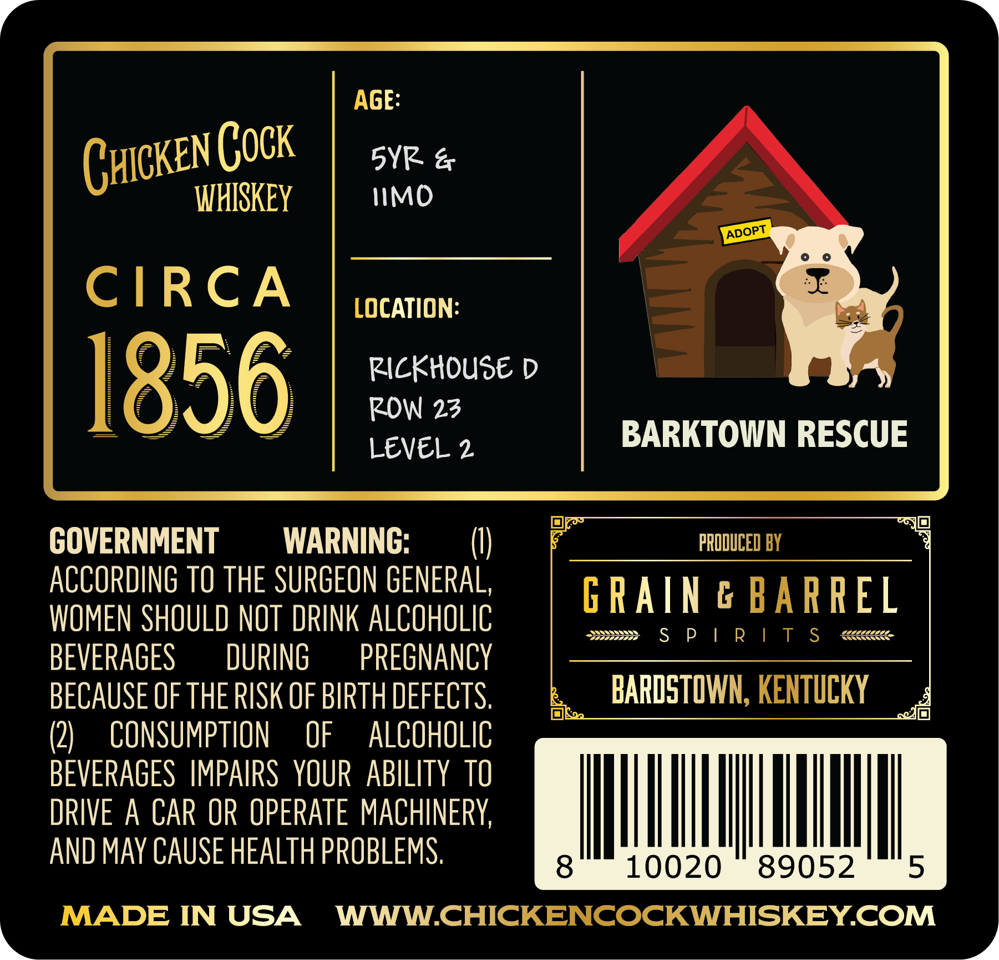
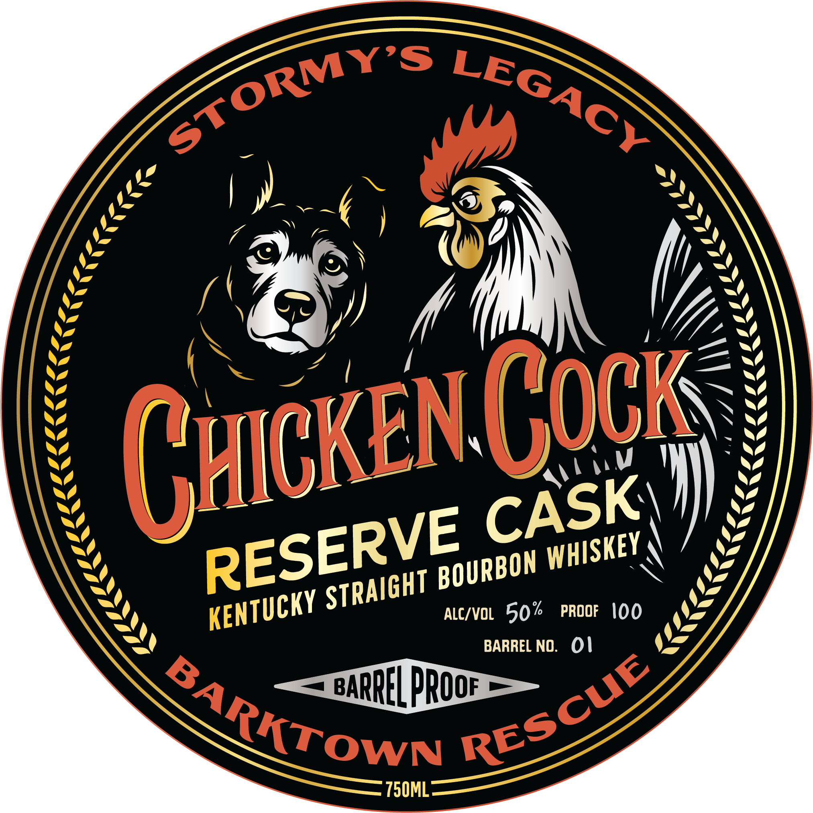

# TTB COLA Label Images - TTBID 26187001000191

**Brand Name:** CHICKEN COCK

**Issue Date:** 07/07/2026

**Origin Code:** 22

**Product Class/Type:** 101

**Source:** [TTB Public COLA Registry](https://ttbonline.gov/colasonline/viewColaDetails.do?action=publicFormDisplay&ttbid=26187001000191)

## Label Images

### Back Label

### Front Label

## Extracted Label Text

*Text extracted via OCR - may contain errors*

### Back Label

AGE

YR &

(HICK

WHISKEY

WMO

ADOPT

oo

CIRCA

LOCATION

RICKHOUSE D

ROW 23

BARKTOWN RESCUE

LEVEL 2

PRODUCED BY

GOVERNMENT

WARNING

U)

ACCORDING TO THE SURGEON GENERAL

GRAING BARREL

WOMEN SHOULD NOT DRINK ALCOHOLIC

sees SP | RIT S

(eee.

BEVERAGES

DURING

PREGNANCY

BECAUSE OF THE RISK OF BIRTH DEFECTS

BARDSTOWN, KENTUCKY

(2

CONSUMPTION OF ALCOHOLIC

BEVERAGES IMPAIRS YOUR ABILITY 10

DRIVE A CAR OR OPERATE MACHINERY.

Il

IN

AND MAY CAUSE HEALTH PROBLEMS

|

|

MADE IN USA WWW.CHICKENCOCKWHISKEY.COM

L

### Front Label

J
Guckej Csch
ALcIVOL 50%
PROOF
ioo
BARREL NO.
01
BARREL prOoF
750ML
STORMYS
LEGAcY
CASK
RESERVE
WHISKEY
BOURBON
STRAIGHT
KENTUCKY
RESCUE
BARKTOWM
