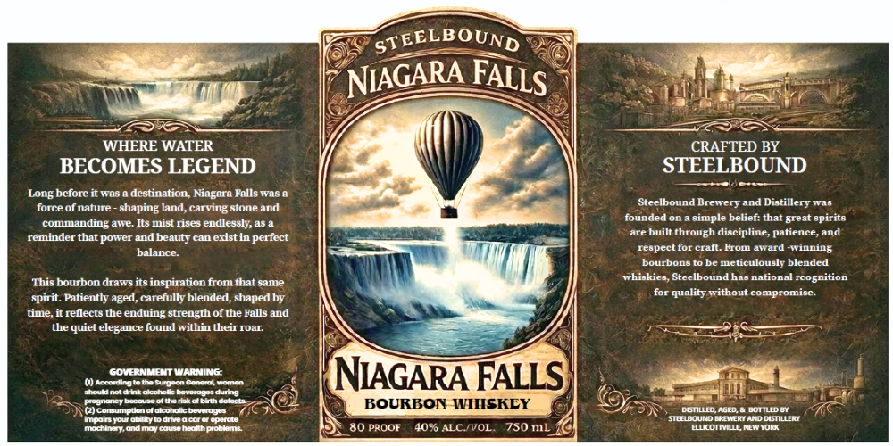
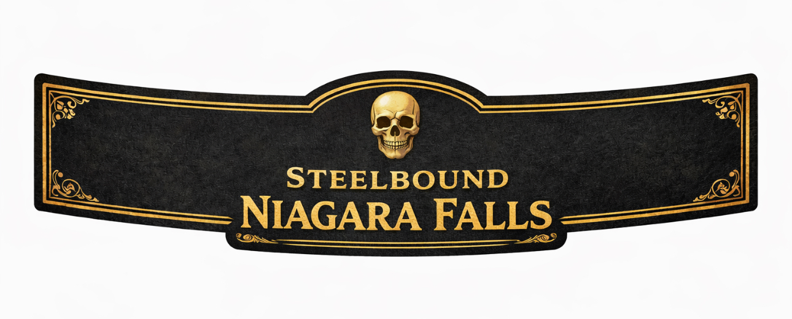

# TTB COLA Label Images - TTBID 26187001000277

**Brand Name:** STEELBOUND

**Fanciful Name:** NIAGARA FALLS BOURBON

**Issue Date:** 07/17/2026

**Origin Code:** 02

**Product Class/Type:** 141

**Source:** [TTB Public COLA Registry](https://ttbonline.gov/colasonline/viewColaDetails.do?action=publicFormDisplay&ttbid=26187001000277)

## Label Images

### Label 1

### Label 2

## Extracted Label Text

*Text extracted via OCR - may contain errors*

*1 image(s) excluded: text did not meet readability threshold*

**Detected Proof:** 80

### Label 1

STEELBOUND
WHERE WATER
CRAFTED BY
BECOMES LEGEND
STEELBOUND
Long before it Was
destination; Niagara Falls was a
Steelbound Brewvery
Diatillery
Tae
force Of nature - shaping land, carving stone and
commanding awe: Its mist rises eudlessl , as
foundedon
simple belief: that
opirite
reminder that pOwer and beauty can existin perfect
are built through discipline, patience,and
respect [Or crall. FrOm aWard
winning
balance
olmnmmte
bc mcticuloualy blended
This bourbon draws its inspiration from that same
whiskies, Steelbound has national
rcognition
quality without compromise
Patieutly aged, carefully blended, shaped by
it reflects the enduing strength of the Falls and
the quiet elegance found within their roar
(0) AecGOvgIoNSENI WarNiNG:oaer
NIAGARA FALLS
ahoudnoldrtacoholc betnngta duitta
Miegnoncybecouseolueamatabumtr
BOURBON WIISKEY
(2) censurpuanolulcphollcbeuetogte
JsneL
Iau
uncalng Keldbt
dntceocttteetle
EnOuamntareenn ose
MeecneieryOndooncauaame uichetcbla uti
80 PROOF
4050 ALC NVOL:
750 mL
Mea
NIAGARA
FALLS
and
Eeat
spiril
Dine,
