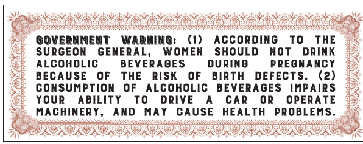
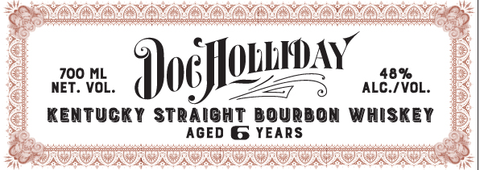
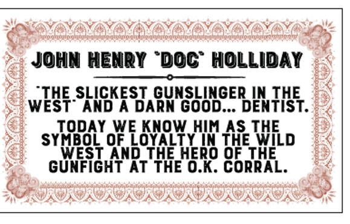

# TTB COLA Label Images - TTBID 26187001000292

**Brand Name:** DOC HOLLIDAY

**Issue Date:** 07/07/2026

**Origin Code:** 22

**Product Class/Type:** 101

**Source:** [TTB Public COLA Registry](https://ttbonline.gov/colasonline/viewColaDetails.do?action=publicFormDisplay&ttbid=26187001000292)

## Label Images

### Back Label

### Front Label

### Label 2

### Label 3

## Extracted Label Text

*Text extracted via OCR - may contain errors*

### Back Label

GoVerNMenT
Warning:
(1)
According
To
THE
SURGEON
GENERAL
WOMEN
SHOULD
not
dRink
ALCOHOLIC
BEVERAGES
DURING
PREGNAnCY
BECAUSE
0F
THE
RISK
OF
BIRTH
DEFECTS.
(2)
conSUmPTiOn
OF
ALCOHOLIC
BEVERAGES
IMPAIRS
YOUR
ABILITY
To
DRIVE
CAR
OR
OPERATE
MACHINERY,
AND
MAY
CAUSE
HEALTH
PROBLEMS.

### Front Label

MoM CXL

fon Doc oe

KENTUCKY STRAIGHT BOURBON WHISKEY
AGED G YEARS

### Label 2

Conicuds

LOOMED

(

AGED & YEARS

DISTILLED IN KENTUCKY

PRODUCT OF USA

RE-IMPORTED BY
AIKO IMPORTERS, INC.
PENDERGRASS, GA, 30567
WWW.AIKOBRANDS.COM

sea annaialnncesaeorinconnie anes npcnaiD saan i

EOKOLO RO RGA

KOKORO KORO NO KOK

### Label 3

Grocscnmewwomens
> JOHN HENRY “DOC” HOLLIDAY —
aH ooo BO,
” “THE SLICKEST GUNSLINGER IN THE
> WEST AND A DARN GOOD... DENTIST.
<> TODAY WEKNOWHIMAS THE
> SYMBOL OF LOYALTY IN THE WILD = <
2) WEST AND THE HERO OF THE £y,
> GUNFIGHT AT THE 0.K. CORRAL. a
LS IORI IOR IIT
