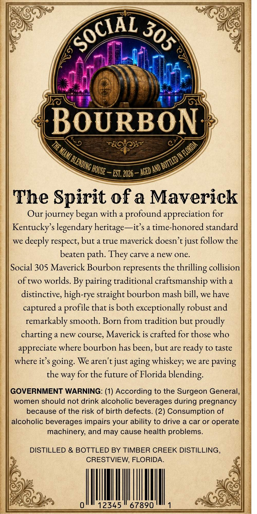
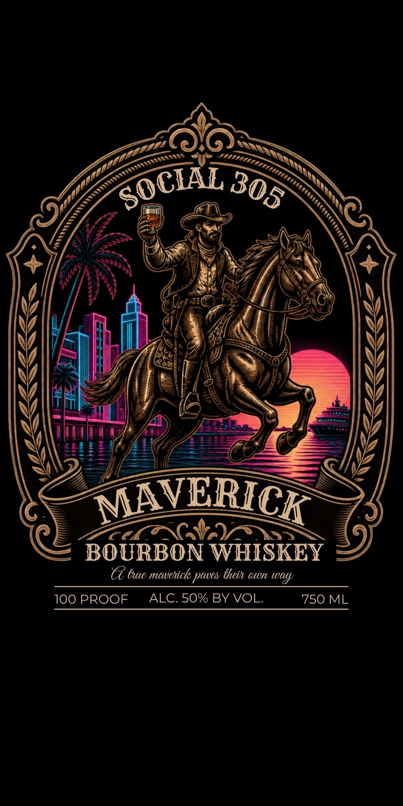

# TTB COLA Label Images - TTBID 26187001000344

**Brand Name:** SOCIAL 305

**Fanciful Name:** MAVERICK

**Issue Date:** 07/07/2026

**Origin Code:** 16

**Product Class/Type:** 141

**Source:** [TTB Public COLA Registry](https://ttbonline.gov/colasonline/viewColaDetails.do?action=publicFormDisplay&ttbid=26187001000344)

## Label Images

### Back Label

### Front Label

## Extracted Label Text

*Text extracted via OCR - may contain errors*

**Detected Proof:** 100

### Back Label

BoURBON
AND'
EST. 2026
The Spirit ofa Maverick
Our journey began with a profound appreciation for
Kentucky' s legendary heritage-~it s a time-honored standard
we
deeply respect; but a true maverick doesn't just follow the
beaten
carve a new one.
Social 305 Maverick Bourbon represents the
' thrilling collision
of two worlds. By pairing traditional craftsmanship with a
distinctive; high-rye straight bourbon mash bill, we have
captured
a
that is both exceptionally robust and
remarkably smooth. Born from tradition but proudly
charting
a new course,
Maverick is crafted for those who
appreciate where bourbon has been, but are
to taste
where it $ going: We aren't just aging whiskey; we are paving
the way for the future of Florida
blending:
GOVERNMENT WARNING: (1) According to the Surgeon General,
women should not drink alcoholic beverages during pregnancy
because of the risk of birth defects. (2) Consumption of
alcoholic beverages impairs your ability to drive a car or operate
machinery; and may cause health problems:
DISTILLED & BOTTLED BY TIMBER CREEK DISTILLING _
CRESTVIEW, FLORIDA
2345
67890
SOCIAZ
305
THE MIAMI E
) IN FLORIDA
BLENDING =
) BOTTLED [
' HOUSE =
AGED
They
path:
profile
ready

### Front Label

MAVERICK
BOURBON WHISKEY
T bue mavchick paves Oheih otn way
100 PROOF
ALC. 50% BY VOL.
750 ML
SOCIAL
305
