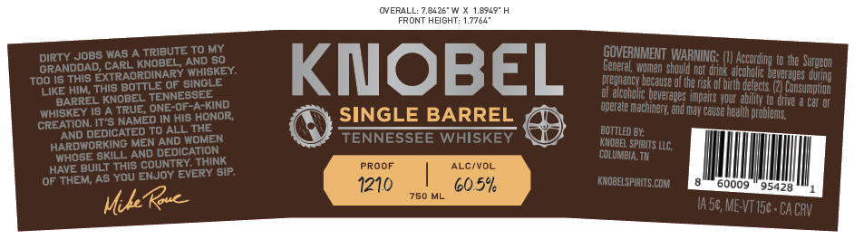
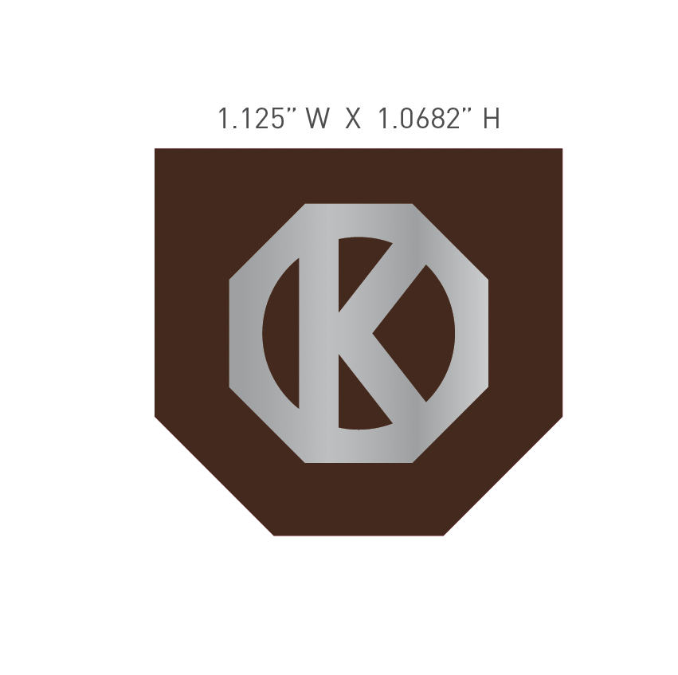
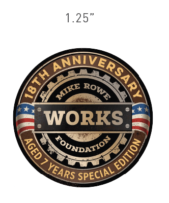

# TTB COLA Label Images - TTBID 26187001000360

**Brand Name:** KNOBEL

**Issue Date:** 07/08/2026

**Origin Code:** 43

**Product Class/Type:** 140

**Source:** [TTB Public COLA Registry](https://ttbonline.gov/colasonline/viewColaDetails.do?action=publicFormDisplay&ttbid=26187001000360)

## Label Images

### Label 1

### Label 2

### Label 3

### Label 4

## Extracted Label Text

*Text extracted via OCR - may contain errors*

*1 image(s) excluded: text did not meet readability threshold*

**Detected Proof:** 121

### Label 1

UYERLLL:
C426
1.8749
FRONT HEIGHT: 1.7764"
dirty JoBS WAS
TRIBUTE TO MY
GOVERNMENT WARNING:
GrANDOAD Caornobezy AidssCy.
KIOBEL
Genean Wmen Skoul rot Ginkvakceori heFe Uge S uuenn
Too IS THIS
This boroik Ofysinoske
Weonaney because or thersk of Buur delecy eZPEanssrdwing
LIkE HIM ThIs
TENNESSEE
Of alcoholic beverages
Consumpuon
BARREIS KNOrUE ONE-0FA-Kind
perate
Impalrs your ability to dive
Gar OF
Whiskey Is A TRUE
HONOR;
SINGLE BARREL
'MaChinery and May Cause heallh problems
CREATION IT's NAMED N
AND DEDICATED To ALL THEE
TENNESSEE WHISKEY
bottled BY;
HARDWORKING MEN
WOMEN
KMQBEL SPIRITS LLC;
MHOSE
DEDRCATIONK
COLUMBIA, TH
HAVE BuILt This country
sip
PROOF
ALC/VOL
OHAHEMLAS YOU ENJOY EVERY
1210
60.5%
KnobeLSPIRITS CoM
60009
95428
750 ML
Kouc
Ia 5s, ME VT156 ^ CA CRV
His
AND
AND
SKILL
Mik

### Label 2

WORK HARD HANDCRAFTED
PLAY FAIR SMALL BATCH
BE KNOBEL

### Label 4

1.25"
WORKS
OUNDATIO"
Rnra
0l
MIKE
RowE
8
1
'YEARS
SPECIAL
