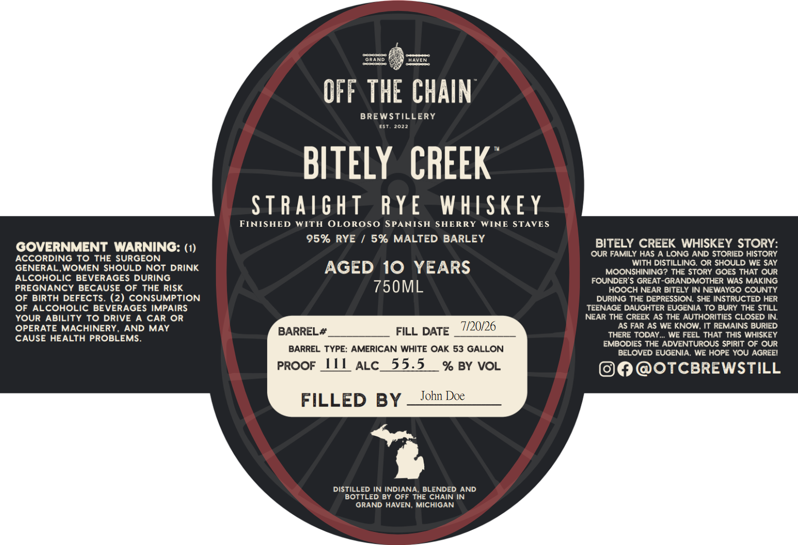

# TTB COLA Label Images - TTBID 26187001000374

**Brand Name:** OFF THE CHAIN BREWSTILLERY

**Issue Date:** 07/21/2026

**Origin Code:** 06

**Product Class/Type:** 102

**Source:** [TTB Public COLA Registry](https://ttbonline.gov/colasonline/viewColaDetails.do?action=publicFormDisplay&ttbid=26187001000374)

## Label Images

### Label 1

## Extracted Label Text

*Text extracted via OCR - may contain errors*

**Detected Age:** 10 Years

### Label 1

ORAND
HAVEN
OFF THE CHAIN
BREWSTILLERY
2022
BITELY  CREEK
StRaight
RYE
WHISKE Y
FINISHED WITH OLOROSO SPANISH
SHERRY
WINE STAVES
95% RYE
5% MALTED BARLEY
BITELY CREEK WHISKEY STORY:
GOVERNMENTWARNING: (1)
OUR FAMILY HAS A LONG AND STORIED HISTORY
ACCORDING To THE SURGEON
WITH DISTILLING. OR SHOULD WE SAY
GENERAL WOMEN SHOULD NOT DRINK
AGED 10
YEARS
MOONSHINING? THE StoRy GOES THAT OUR
ALCOHOLIC BEVERAGES DURING
FOUNDER'$ GREAT-GRANDMOTHER WAS MAKING
PREGNANCY BECAUSE OF THE RISK
750ML
HOOCH NEAR BITELY IN NEWAYGO COUNTY
OF BIRTH DEFECTS. (2) CONSUMPTION
DURING ThE DEPRESSION. SHE INSTRUCTED HER
OF ALCOHOLIC BEVERAGES IMPAIRS
TEENAGE DAUGHTER EUGENIA TO BURY THE STILL
Your AbBILITY To DRIVE
A CAR OR
NEAR THE CREEK AS THE AuthORITIES CLOSED IN
OPERATE MACHINERY
AND MAY
BARREL #
FILL DATE
7/20/26
AS FAR AS WE KNOW, It REMAINS BURIED
CAUSE HEALTH PROBLEMS
THeRE TODAY.
WE FEEL THAT This WHISKEY
EMBODIES THE ADVENTUROUS SPIRIT OF OUR
BARREL TYPE: AMERICAN WHITE OAK 53 GALLON
BELOVED EUGENIA
WE HOPE YOU AGREEI
PROOF
M
ALC
55.5
% BY VOL
OTCBREWSTILL
FILLED BY
John Doe
DIStILLED IN INDIANA
BLENDED AND
BOTTLED BY OFF THE CHAIN IN
GRAND HAVEN;
MICHIGAN
