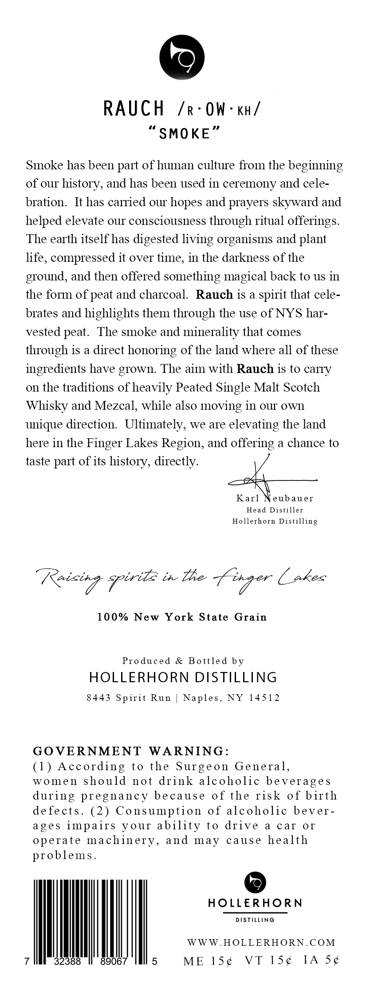
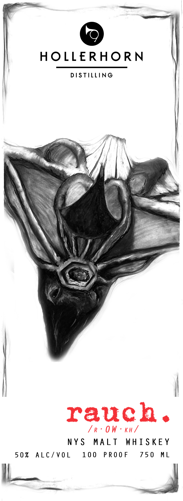

# TTB COLA Label Images - TTBID 26187001000393

**Brand Name:** HOLLERHORN DISTILLING

**Fanciful Name:** RAUCH

**Issue Date:** 07/13/2026

**Origin Code:** 02

**Product Class/Type:** 118

**Source:** [TTB Public COLA Registry](https://ttbonline.gov/colasonline/viewColaDetails.do?action=publicFormDisplay&ttbid=26187001000393)

## Label Images

### Back Label

### Front Label

### Label 3

## Extracted Label Text

*Text extracted via OCR - may contain errors*

*1 image(s) excluded: text did not meet readability threshold*

### Back Label

RAUCH /r-OW-ku/
“SMOKE”

Smoke has been part of human culture from the beginning
of our history, and has been used in ceremony and cele-
bration. It has carried our hopes and prayers skyward and
helped elevate our consciousness through ritual offerings.
The earth itself has digested living organisms and plant
life, compressed it over time, in the darkness of the
ground, and then offered something magical back to us in
the form of peat and charcoal. Rauch is a spirit that cele-
brates and highlights them through the use of NYS har-
vested peat. The smoke and minerality that comes
through is a direct honoring of the land where all of these

ingredients have grown. The aim with Rauch is to carry
on the traditions of heavily Peated Single Malt Scotch
Whisky and Mezcal, while also moving in our own
unique direction. Ultimately, we are elevating the land
here in the Finger Lakes Region, and offering a chance to

taste part of its history, directly.
Karl Vet auer

Head Distiller
Hollerhorn Distilling

ag Pris in he fF taper fakes

100% New York State Grain

Produced & Bottled by
HOLLERHORN DISTILLING

8443 Spirit Run | Naples, NY 14512

GOVERNMENT WARNING:

(1) According to the Surgeon General,
women should not drink alcoholic beverages
during pregnancy because of the risk of birth
defects. (2) Consumption of alcoholic bever-
ages impairs your ability to drive a car or
operate machinery, and may cause health
problems.

| HOLLERHORN

DISTILLING

WWW.HOLLERHORN.COM
7 IN 32388 IP 89067 IM 5 ME 15¢ VT 15¢ IA S¢

### Label 3

Pao

HOLLERHORN

DISTILLING

ineioep pir tl in The LEX

©

HOLLERHORN

DISTILLING

D=Agq A=
