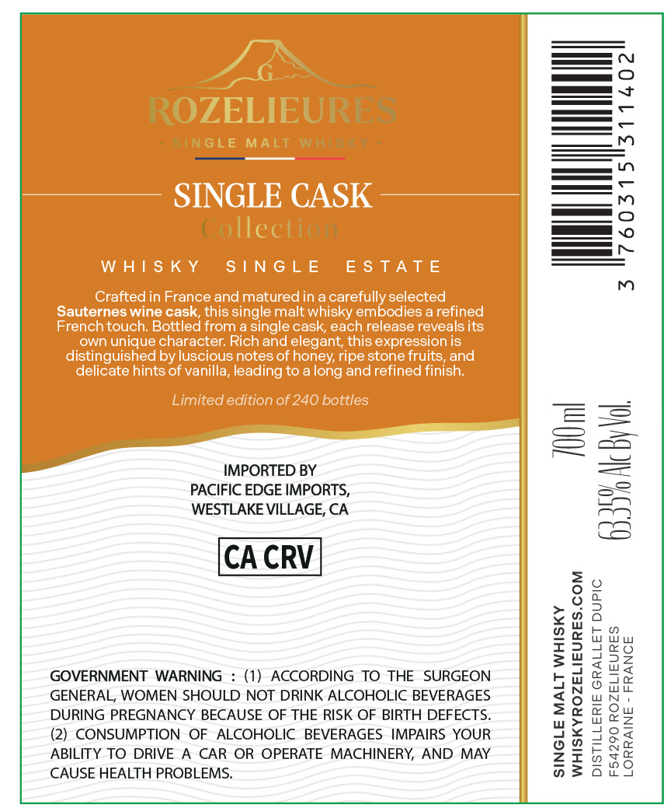
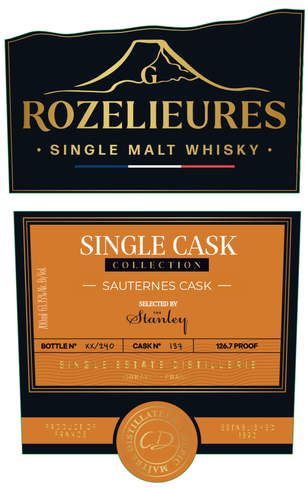

# TTB COLA Label Images - TTBID 26187001000482

**Brand Name:** ROZELIEURES

**Issue Date:** 07/09/2026

**Origin Code:** 51

**Product Class/Type:** 118

**Source:** [TTB Public COLA Registry](https://ttbonline.gov/colasonline/viewColaDetails.do?action=publicFormDisplay&ttbid=26187001000482)

## Label Images

### Back Label

### Front Label

## Extracted Label Text

*Text extracted via OCR - may contain errors*

**Detected Proof:** 126.7

### Back Label

ROZELIEURE
ENGLE
M ALT
WNh
1
SINGLE CASK
1
(ollectio
W HI S KY
S | N G L E
E S TAT E
m
Crafted in France and matured in a carefully selected
Sauternes wine cask this single malt whisky embodies a refined
French touch: Bottled from a single cask; each release reveals its
own
unique character: Rich and elegant, this expression is
distinguished by luscious notes of honey; ripe stone fruits; and
delicate hints of vanilla; leading to along and refined finish:
Limited edition of 240 bottles
IMPORTED BY
44
PACIFIC EDGE IMPORTS
WESTLAKE VILLAGE, CA
3
CA CRV
3
GONERNMEOMEA MHOGLD (NOT DRORDANGOHOLIEBEVRAGS
J

7
H
DURING PREGNANCY BECAUSE OF THE RISK OF BIRTH DEFECTS.
8
(2) CONSUMPTION OF
ALCOHOLIC
BEVERAGES IMPAIRS YOUR
1
ABILITY TO DRIVE
CAR OR OPERATE
MACHINERY; AND
MAY
Ji
CAUSE HEALTH PROBLEMS.

### Front Label

weN

OZELIEUR

- SINGLE MALT WHISKY

SINGLE CASK

ete b bani

— SAUTERNES CASK —

SELECTED BY

700ml 63.35% Alc By\ol.
