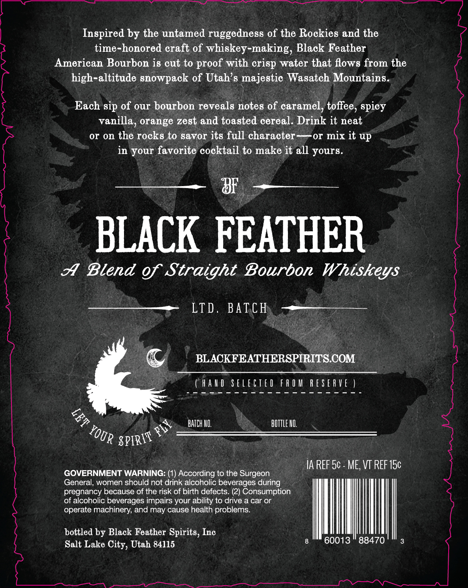
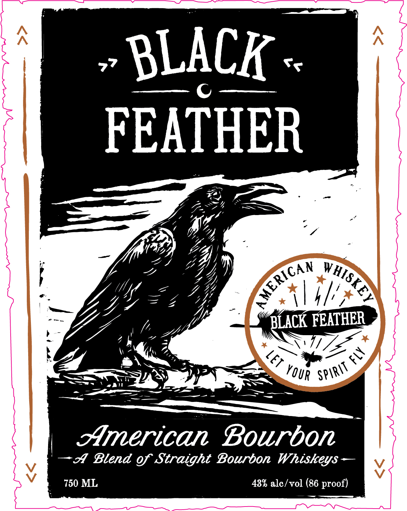

# TTB COLA Label Images - TTBID 26187001000483

**Brand Name:** BLACK FEATHER WHISKEY

**Issue Date:** 07/09/2026

**Origin Code:** 45

**Product Class/Type:** 121

**Source:** [TTB Public COLA Registry](https://ttbonline.gov/colasonline/viewColaDetails.do?action=publicFormDisplay&ttbid=26187001000483)

## Label Images

### Back Label

### Front Label

## Extracted Label Text

*Text extracted via OCR - may contain errors*

**Detected Proof:** 86

### Back Label

Inspired by the untamed ruggedness of the Rockies and the
time-honored craft of whiskey-making, Black Feather
American Bourbon i8 cut to proof with
water that flows from the
high-altitude snowpack of Utah's majestic Wasatch Mountains.
Each sip of our bourbon reveals notes of caramel, toffee, spicy
vanilla, orange zest and toasted cereal. Drink it neat
or on the rocks to savor its full character-
Or mix it up
in your favorite cocktail to make it all yours.
8F
BLACK FEATHER
A
Blend of Straight Bourbon Whiskeys
LTD , BATCH
BLACKFEATHERSPIRITSCOM
hau
S FLECTEd
F R 0 M
R e S E R Ve
BATCh HI
bOTTLe HO:
$6
IA REF Sc - ME, VT REF I5c
GOVERNMENT WARNING: (1) According to the Surgeon
General, women should not drink alcoholic beverages during
pregnancy because of the risk of birth defects: (2) Consumption
of alcoholic beverages impairs your ability to drive a car or
operate machinery; and may cause health problems_
bottled by Black Feather Spirits, Inc
Salt Lake
Utah 84115
60013
88470
crisp
5
YOUR
SPIRIT
City,

### Front Label

BLACK
FEATHER
BLACK FEATHER
American
Bourbon
A Blend of Straight Bourbon Whiskeys
750 ML
43% alc / vol (86 proof)
AMERICAN
VHISKEY
FLY
LeT
Spirit
YOUR
