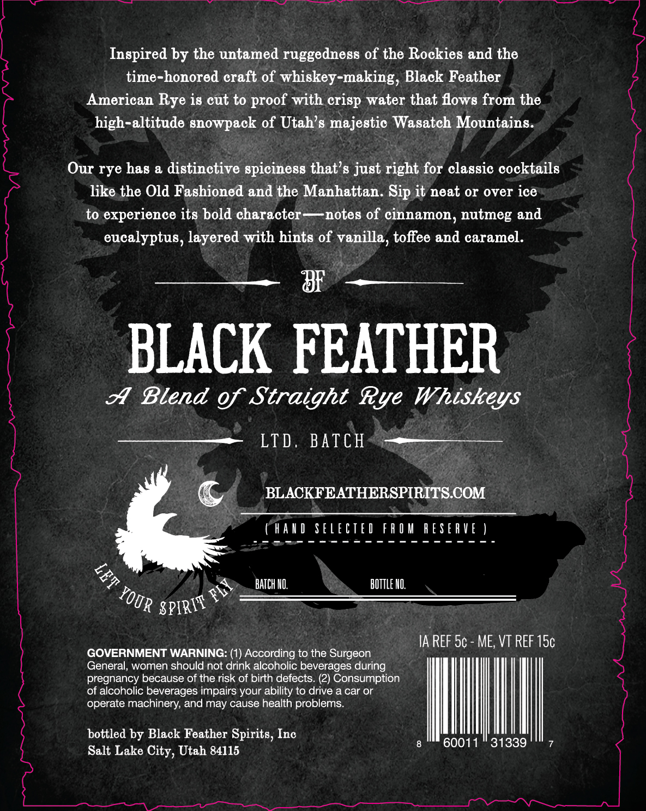
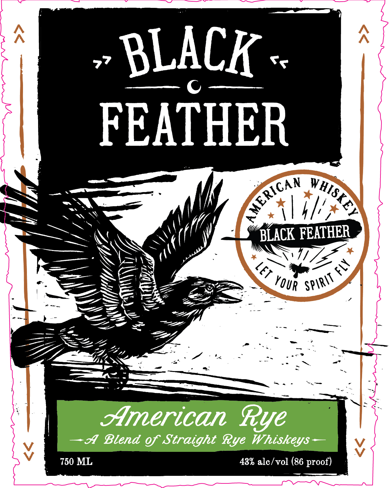

# TTB COLA Label Images - TTBID 26187001000502

**Brand Name:** BLACK FEATHER WHISKEY

**Issue Date:** 07/08/2026

**Origin Code:** 45

**Product Class/Type:** 122

**Source:** [TTB Public COLA Registry](https://ttbonline.gov/colasonline/viewColaDetails.do?action=publicFormDisplay&ttbid=26187001000502)

## Label Images

### Back Label

### Front Label

## Extracted Label Text

*Text extracted via OCR - may contain errors*

**Detected Proof:** 86

### Back Label

Inspired by the untamed ruggedness of the Rockies and the

time-honored craft of whiskey-making, Black Feather

;

American Rye is cut to proof with crisp water that flows from the

high-altitude snowpack of Utah’s majestic Wasatch Mountains.

Our rye has a distinctive spiciness that’s just right for classic cocktails

like the Old Fashioned and the Manhattan. Sip it neat or over ice

;

to experience its bold character—notes of cinnamon, nutmeg and

eucalyptus, layered with hints of vanilla, toffee and caramel.

oF

BLACK FEATHER

A Blend of Straight Rye Whiskeys

LTD. BATCH

BLACKFEATHERSPIRITS.COM

©

CHAND SELECTED FROM RESERVE )

2 awe ais Seles aes Se

&

BATCH NO.

BOTTLE NO.

sprints mY

IA REF 5¢ - ME, VT REF 15¢

)VERNMENT WARNING: (1) According to the Surgeon

General, women should not drink alcoholic beverages during

of alcoholic beverages impairs your ability to drive a car or

pregnancy because of the risk of birth defects. (2) Consumption

operate machinery, and may cause health problems.

bottled by Black Feather Spirits, Inc

mil

Salt Lake City, Utah 84115

### Front Label

BLACK
FEATHER
BLACK FEATHER
4
2
American Rye
Blend of Straight Rye Whiskeys
750 ML
43% alc /vol (86 proof)
AMERIGAN
VHISKEY
leT
SpiriT
Your
