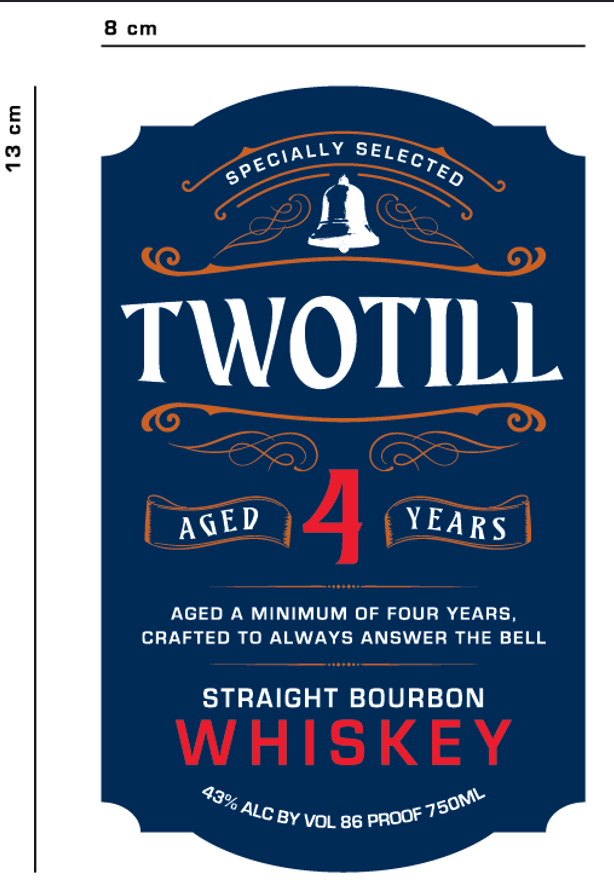
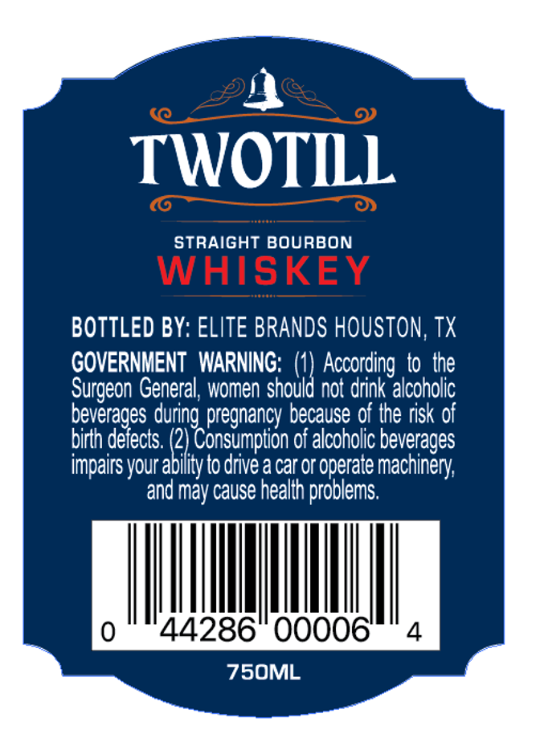

# TTB COLA Label Images - TTBID 26187001000590

**Brand Name:** TWO TILL

**Issue Date:** 07/08/2026

**Origin Code:** 43

**Product Class/Type:** 101

**Source:** [TTB Public COLA Registry](https://ttbonline.gov/colasonline/viewColaDetails.do?action=publicFormDisplay&ttbid=26187001000590)

## Label Images

### Label 1

### Label 2

## Extracted Label Text

*Text extracted via OCR - may contain errors*

### Label 1

cm
5
2
TWOTILL
4
AGED
A MINIMUM OF FOUR YEARS
CRAFTED TO ALWAYS ANSWER THE BELL
STRAIGHT BOURBON
WHISKEY
BY VOL 86
SPECIALLY
SELECTED
AGED
YEARS
43% .
75OML
ALC E
PROOF "

### Label 2

TWOTILL
STRAIGHT BOURBON
WHISKEY
BOTTLED BY: ELITE BRANDS HOUSTON, TX
GOVERNMENT  WARNING: (4) According  to the
Surgeon General; women should not drink alcoholc
beverages during pregnancy because of Ihe risk of
birth defects: (2) Consumption of alcoholic beverages
impairs your ability to drive a car or operate machinery;
and may cause health problems:
44286
00006'
4
75OML
