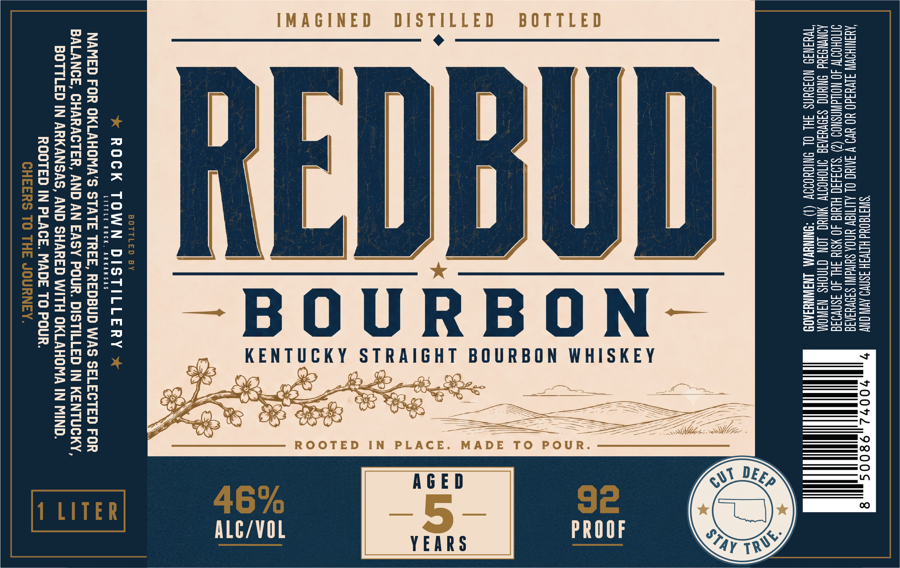

# TTB COLA Label Images - TTBID 26187001000643

**Brand Name:** REDBUD

**Issue Date:** 07/10/2026

**Origin Code:** 12

**Product Class/Type:** 101

**Source:** [TTB Public COLA Registry](https://ttbonline.gov/colasonline/viewColaDetails.do?action=publicFormDisplay&ttbid=26187001000643)

## Label Images

### Label 1

## Extracted Label Text

*Text extracted via OCR - may contain errors*

### Label 1

‘SINAT@0Ud HIIVSH ASNVO AVN ONY 70072,9800S
AQANIHOWNN JIVUId0 YO YW V INUC OL ALITIGV UNOA SUING! SIOVUSNIE
IMOHOITW 40 NOWAWNSNOD (2) ‘S103430 HINIG 40 ¥SI4 SHL 40 asnva3a
AQNYNG3Ud NUN SIOVUINIA INOHOT NHC JON CINGHS NAINOM
TWUINI9 NOSSUNS 3H OL BNICHODOW (1) “BNINEWMA LNGINNYSAO8

BOTTLED

ROOTED IN PLACE. MADE TO POUR

IMAGINED DISTILLED

;

KENTUCKY STRAIGHT BOURBON WHISKEY

a
_—)
a
™—
eS
a
=

—~BOURBON-

R

ROCK TOWN DISTILLERY

LITTLE ROCK, ARKANSAS

NAMED FOR OKLAHOMA'S STATE TREE, REDBUD WAS SELECTED FOR
BALANCE, CHARACTER, AND AN EASY POUR. DISTILLED IN KENTUCKY,
BOTTLED IN ARKANSAS, AND SHARED WITH OKLAHOMA IN MIND.
ROOTED IN PLACE. MADE TO POUR.
