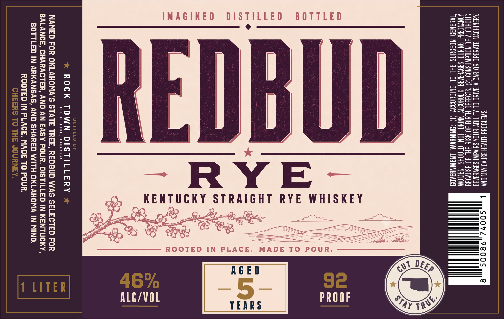

# TTB COLA Label Images - TTBID 26187001000646

**Brand Name:** REDBUD

**Issue Date:** 07/10/2026

**Origin Code:** 12

**Product Class/Type:** 102

**Source:** [TTB Public COLA Registry](https://ttbonline.gov/colasonline/viewColaDetails.do?action=publicFormDisplay&ttbid=26187001000646)

## Label Images

### Label 1

## Extracted Label Text

*Text extracted via OCR - may contain errors*

### Label 1

ELENA MN Ly SO072 9800S a 8
AQINIHOWNN JIVUId0 YO YW V INUC OL ALITIGV UNOA SHINAI! SIOVUSNIE
IMOHOITW 40 NOWAWNSNOD (2) *S103430 HIMIG 40 ¥SI4 SHL 40 asnvo3a
AQNWNS3Ud NUN SIIVUIAIG INOHOTW YING JON CINGHS NAINOM
TWYINI9 NOIDUNS 3H OL DNICHODOW (1) “SNINEWAA LNGINNYSA08

UD

BOTTLED

[a __

*

ROOTED IN PLACE. MADE TO POUR.

IMAGINED DISTILLED

|
E

—_
[—)
a
—~
es
—_
=

ROCK TOWN DISTILLERY

LITTLE ROCK, ARKANSAS

NAMED FOR OKLAHOMA’S STATE TREE, REDBUD WAS SELECTED FOR
BALANCE, CHARACTER, AND AN EASY POUR. DISTILLED IN KENTUCKY,
BOTTLED IN ARKANSAS, AND SHARED WITH OKLAHOMA IN MIND.
ROOTED IN PLACE. MADE TO POUR.
