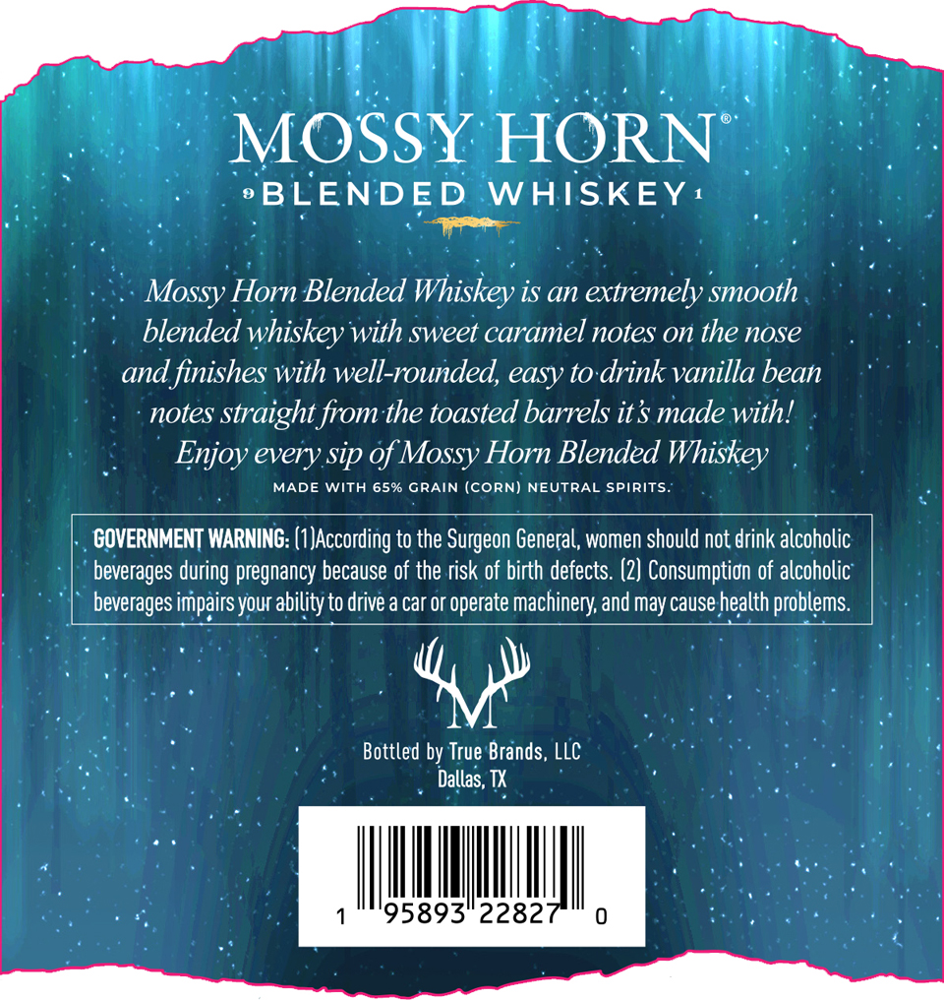
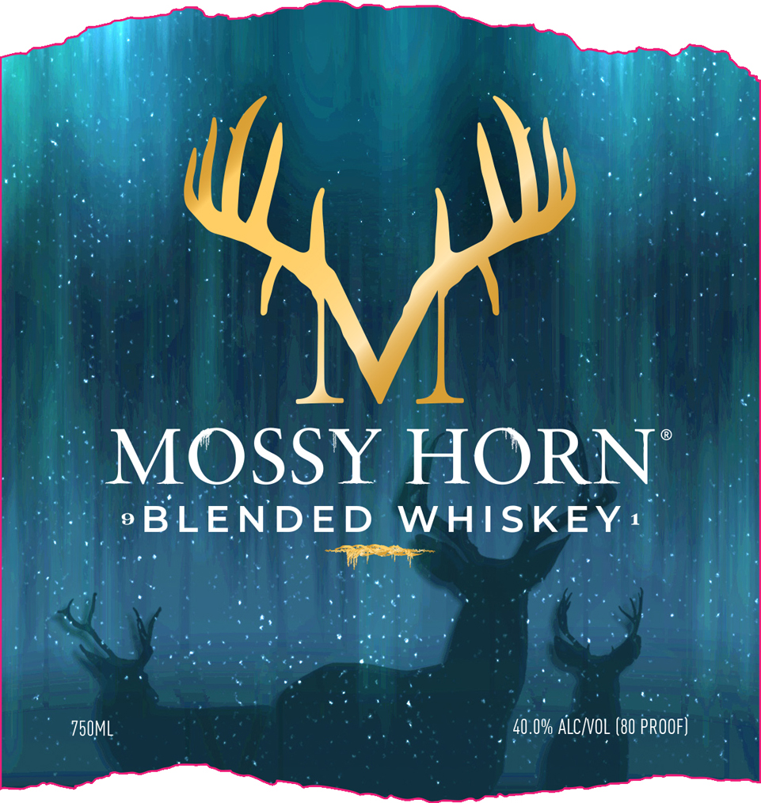

# TTB COLA Label Images - TTBID 26188001000029

**Brand Name:** MOSSY HORN

**Issue Date:** 07/13/2026

**Origin Code:** 44

**Product Class/Type:** 137

**Source:** [TTB Public COLA Registry](https://ttbonline.gov/colasonline/viewColaDetails.do?action=publicFormDisplay&ttbid=26188001000029)

## Label Images

### Back Label

### Front Label

## Extracted Label Text

*Text extracted via OCR - may contain errors*

**Detected Proof:** 80

### Back Label

MOSSY HORN
BLENDED
WAISKEY
Mossy Horn Blended Whiskey is an extremely smooth
blended whiskey with sweet caramel notes on the nose
and finishes with well-rounded, easy to drink vanilla bean
notes straight from the toasted barrels it$ made with!
Enjoy every sip of Mossy Horn Blended Whiskey
MADE
WITH 65% GRAIN (CORN) NEUTRAL SPIRITS_
GOVERNMENT WARNING: (1 JAccording to the Surgeon General, women should not drink alcoholic
beverages during pregnancy because of the risk of birth defects. (2) Consumption of alcoholic
beverages impairsyour ability to drive a car or operate machinery; and may cause health problems
Bottled by True Brands, LLC
Dallas; TX
95893"22827

### Front Label

4
MOSSY HORN
9
BLENDED
WHISKEY 1
750ML
40.0% alcnol (80 pROOF)
