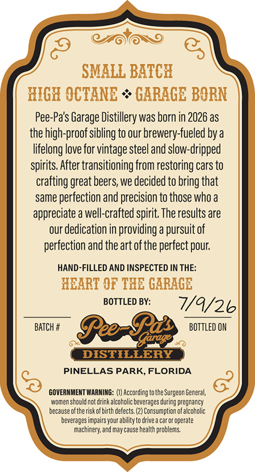
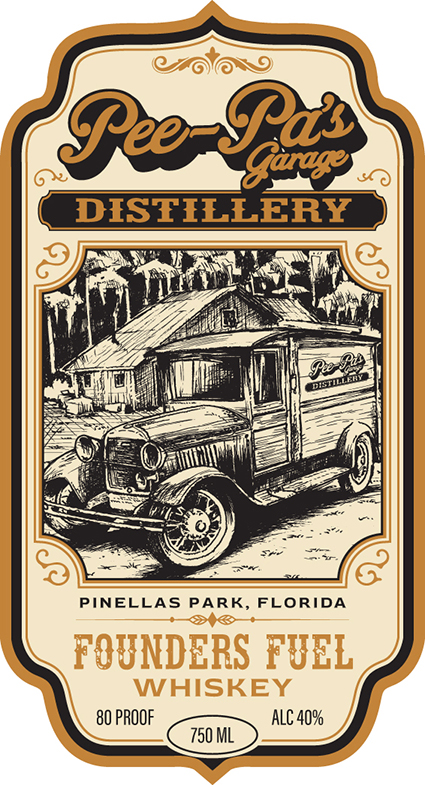

# TTB COLA Label Images - TTBID 26188001000085

**Brand Name:** PEE-PA'S GARAGE DISTILLERY

**Issue Date:** 07/09/2026

**Origin Code:** 16

**Product Class/Type:** 140

**Source:** [TTB Public COLA Registry](https://ttbonline.gov/colasonline/viewColaDetails.do?action=publicFormDisplay&ttbid=26188001000085)

## Label Images

### Back Label

### Label 1

## Extracted Label Text

*Text extracted via OCR - may contain errors*

**Detected Proof:** 80

### Back Label

SMALL BATCH
RIGE OCTANE
GARAGE BORN
Pee-Pa's Garage Distillery was born in 2026 as
the high-proofsibling to our brewery-fueled by a
lifelong love for vintage steel and slow-dripped
spirits. After transitioning from restoring cars to
crafting great beers, we decided to bring that
same perfection and precision to those who a
appreciate a well-crafted spirit The results are
our dedication in providing a pursuit of
perfection and theart ofthe perfect pour;
HAND-FILLED AND INSPECTED IN THE:
HEART €F THE GARAGE
BOTTLED BY:
7/9/26
BATCH #
See-Bds
BOTtled OM
DISTIELERY
PINELLAS PARK,FLORIDA
GOVERNMENT WARHING=
According tothe Surgeon General,
women should not drink alcoholic beverages during pregnancy
because oftherisk ofbirth defects (2) Consumption ofalcoholic
beverages impairs yourabilidy to drivea car Or operate
machinery; and may cause health problems

### Label 1

B2BA
DISTILLERY
PINELLAS PARK, FLORIDA
FOUNDERS FUEL
WHISKEY
80 PROOF
ALC 409
750 ML
