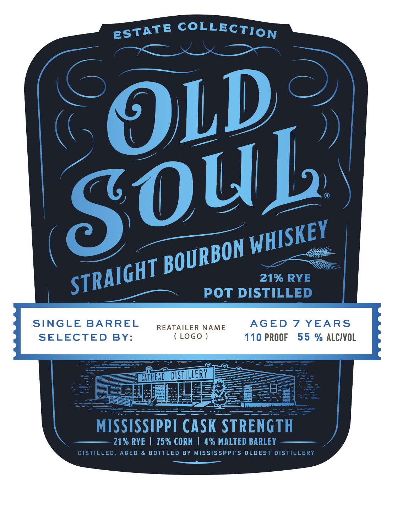
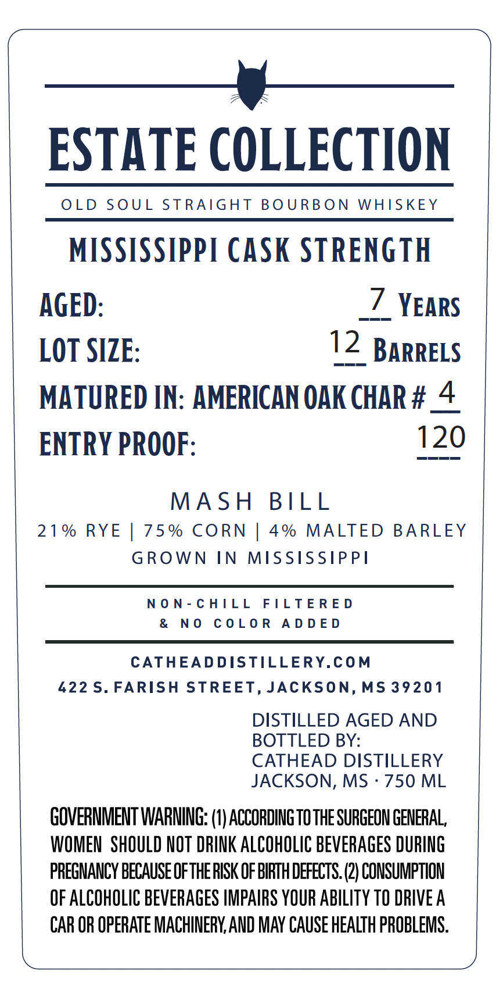

# TTB COLA Label Images - TTBID 26188001000100

**Brand Name:** OLD SOUL

**Fanciful Name:** 21% RYE

**Issue Date:** 07/22/2026

**Origin Code:** 28

**Product Class/Type:** 101

**Source:** [TTB Public COLA Registry](https://ttbonline.gov/colasonline/viewColaDetails.do?action=publicFormDisplay&ttbid=26188001000100)

## Label Images

### Label 1

### Label 2

## Extracted Label Text

*Text extracted via OCR - may contain errors*

**Detected Proof:** 110
**Detected Age:** 7 Years

### Label 1

COLLECTION
OLD
21% RYE
POT DISTILLED
SINGLE
BARREL
REATAILER NAME
AGED
7 YEARS
SELECTED
BY:
LOGo
110 PROOF
55 % ALCIVOL
cifHend DISTWLERV
B
E1
333
MISSISSIPPI CASK STRENGTH
21% RYE
75% CORN
% MALTED BARLEY
DISTILLED_
AGED
& BOTTLED BY MISSISSPPI'5 OLDEST DISTILLERY
ESTATE
SOug
WHISKEY
BOURBON
STRAIGHT

### Label 2

ESTATE COLLECTION

OLD SOUL STRAIGHT BOURBON WHISKEY

MISSISSIPPI CASK STRENGTH

AGED: _7 YEARS
LOT SIZE: 12 BarreLs
MATURED IN: AMERICAN OAK CHAR #_4
ENTRY PROOF: 120

MASH BILL
21% RYE | 75% CORN | 4% MALTED BARLEY
GROWN IN MISSISSIPPI

NON-CHILL FILTERED
& NO COLOR ADDED

CATHEADDISTILLERY.COM
422 S. FARISH STREET, JACKSON, MS 39201
DISTILLED AGED AND
BOTTLED BY:
CATHEAD DISTILLERY
JACKSON, MS - 750 ML
GOVERNMENT WARNING: (1) ACCORDING TO THE SURGEON GENERAL,
WOMEN SHOULD NOT DRINK ALCOHOLIC BEVERAGES DURING
PREGNANCY BECAUSE OF THE RISK OF BIRTH DEFECTS. (2) CONSUMPTION
OF ALCOHOLIC BEVERAGES IMPAIRS YOUR ABILITY TO DRIVE A
CAR OR OPERATE MACHINERY, AND MAY CAUSE HEALTH PROBLEMS.
