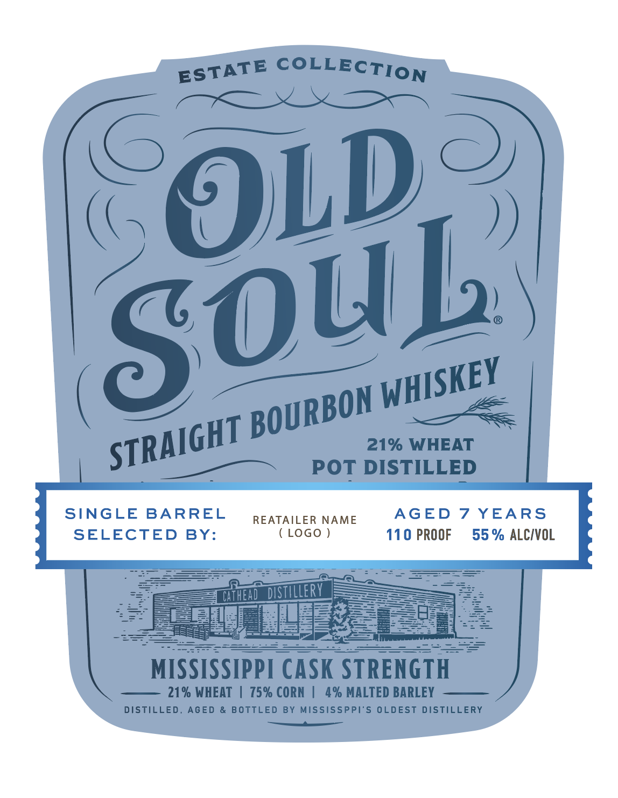
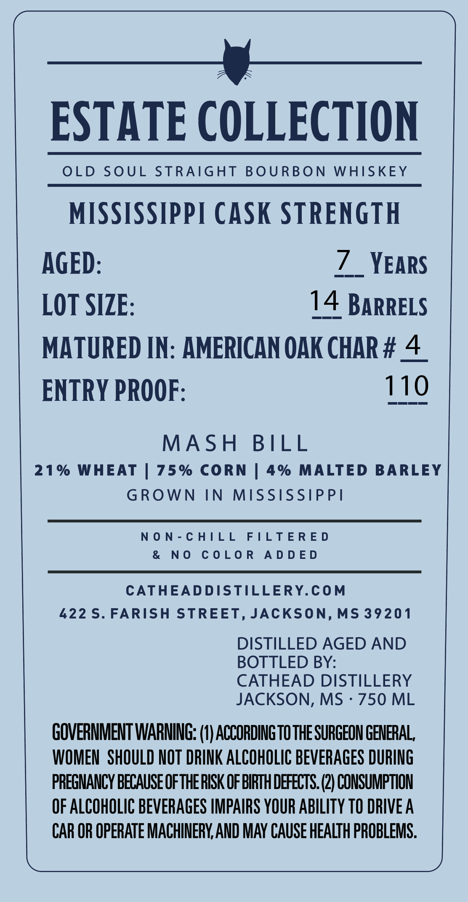

# TTB COLA Label Images - TTBID 26188001000102

**Brand Name:** OLD SOUL

**Fanciful Name:** 21% WHEAT

**Issue Date:** 07/22/2026

**Origin Code:** 28

**Product Class/Type:** 101

**Source:** [TTB Public COLA Registry](https://ttbonline.gov/colasonline/viewColaDetails.do?action=publicFormDisplay&ttbid=26188001000102)

## Label Images

### Label 1

### Label 2

## Extracted Label Text

*Text extracted via OCR - may contain errors*

**Detected Proof:** 110
**Detected Age:** 7 Years

### Label 1

COLLECTION
OL)_
21% WHEAT
POT DISTILLED
SINGLE
BARREL
REATAILER NAME
AGED
7 YEARS
SELECTED
BY:
LOGo )
110 PROOF
55 % ALCIVOL
CAFhEAD_distilleRV
MISSISSIPPI CASK STRENGTH
21% WHEAT
75% CORN
4% MALTED BARLEY
DISTILLED ,
AGED
& BOTTLED
BY Mississppi'S OLDEST DISTILLERY
ESTATE
SOub
WHISKEY
BOURBON
STRAIGHT

### Label 2

(ES

—____jy____
ESTATE COLLECTION

OLD SOUL STRAIGHT BOURBON WHISKEY

MISSISSIPPI CASK STRENGTH

AGED: 7 _ YEARS
LOT SIZE: 14 BARRELS
MATURED IN: AMERICAN OAK CHAR # 4
ENTRY PROOF: 110

MASH BILL
21% WHEAT | 75% CORN | 4% MALTED BARLEY
GROWN IN MISSISSIPPI

NON-CHILL FILTERED
& NO COLOR ADDED

CATHEADDISTILLERY.COM
422 S. FARISH STREET, JACKSON, MS 39201
DISTILLED AGED AND
BOTTLED BY:
CATHEAD DISTILLERY
JACKSON, MS - 750 ML
GOVERNMENT WARNING: (1) ACCORDING TO THE SURGEON GENERAL,
WOMEN SHOULD NOT DRINK ALCOHOLIC BEVERAGES DURING
PREGNANCY BECAUSE OF THE RISK OF BIRTH DEFECTS. (2) CONSUMPTION
OF ALCOHOLIC BEVERAGES IMPAIRS YOUR ABILITY TO DRIVE A
CAR OR OPERATE MACHINERY, AND MAY CAUSE HEALTH PROBLEMS.
