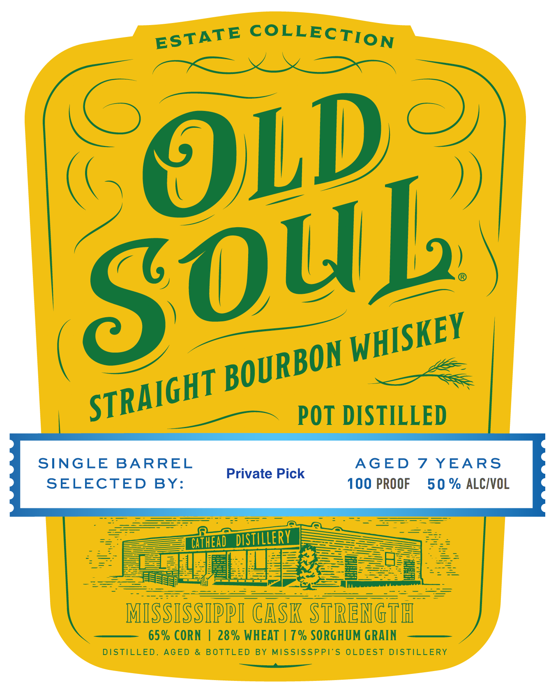
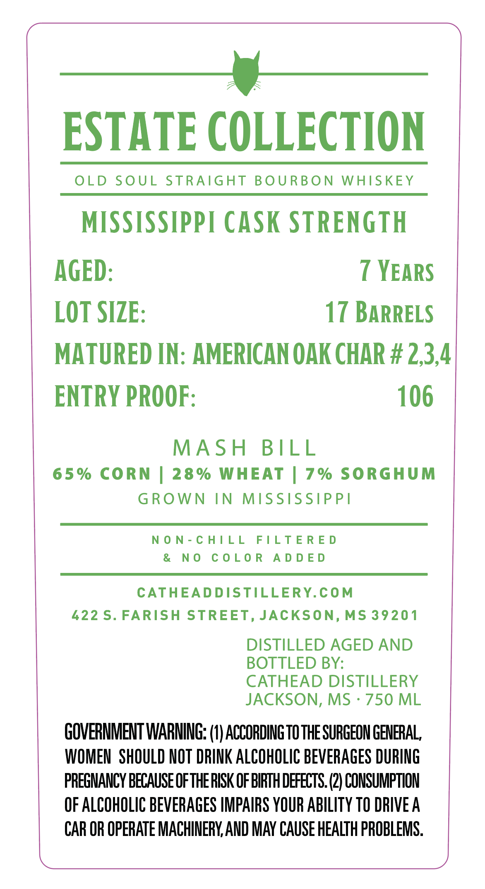

# TTB COLA Label Images - TTBID 26188001000111

**Brand Name:** OLD SOUL

**Issue Date:** 07/29/2026

**Origin Code:** 28

**Product Class/Type:** 101

**Source:** [TTB Public COLA Registry](https://ttbonline.gov/colasonline/viewColaDetails.do?action=publicFormDisplay&ttbid=26188001000111)

## Label Images

### Front Label

### Label 2

## Extracted Label Text

*Text extracted via OCR - may contain errors*

**Detected Proof:** 100
**Detected Age:** 7 Years

### Front Label

COLLECTION
OLD
POT DISTILLED
SINGLE
BARREL
AGED
7 YEARS
Private Pick
SELECTED
BY:
100 PROOF
50 % ALCIVOL
Cifhend  distillerv
F
776
MISSISSIPPI CASK STRENgTh
65% CORN
28% WHEAT | 7 % SORGHUM GRAIN
DISTILLED,
AGED
BOTTLED
BY
MISSISSPPT'S OLDEST
DISTILLERY
ESTATE
Soub
WHISKEY
BOURBON
STRAIGHT
4

### Label 2

_—_gj__
ESTATE COLLECTION

OLD SOUL STRAIGHT BOURBON WHISKEY

MISSISSIPPI CASK STRENGTH

AGED: 7 YEARS
LOT SIZE: 17 BARRELS
MATURED IN: AMERICAN OAK CHAR # 2,3,4
ENTRY PROOF: 106

MASH BILL
65% CORN | 28% WHEAT | 7% SORGHUM
GROWN IN MISSISSIPPI

NON-CHILL FILTERED
& NO COLOR ADDED

CATHEADDISTILLERY.COM
422 S. FARISH STREET, JACKSON, MS 39201
DISTILLED AGED AND
BOTTLED BY:
CATHEAD DISTILLERY
JACKSON, MS - 750 ML
GOVERNMENT WARNING: (}) ACCORDING TO THE SURGEON GENERAL
WOMEN SHOULD NOT DRINK ALCOHOLIC BEVERAGES DURING
PREGNANCY BECAUSE OFTHE RISK OF BIRTH DEFECTS. 2) CONSUMPTION
OF ALCOHOLIC BEVERAGES IMPAIRS YOUR ABILITY TO DRIVE A
CAR OR OPERATE MACHINERY AND MAY CAUSE HEALTH PROBLEMS.
