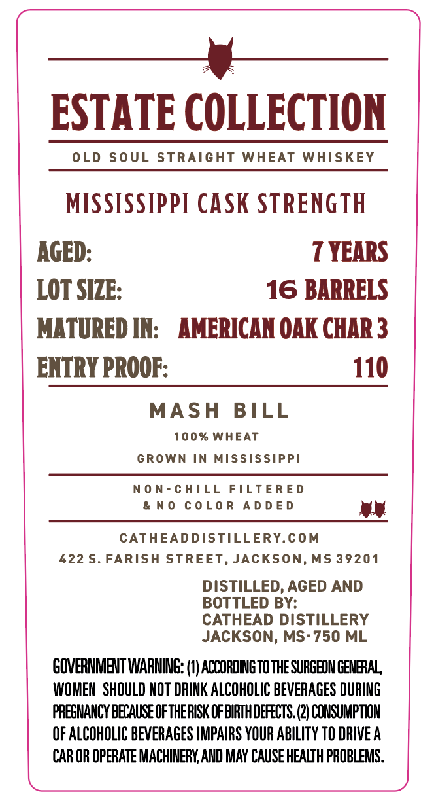
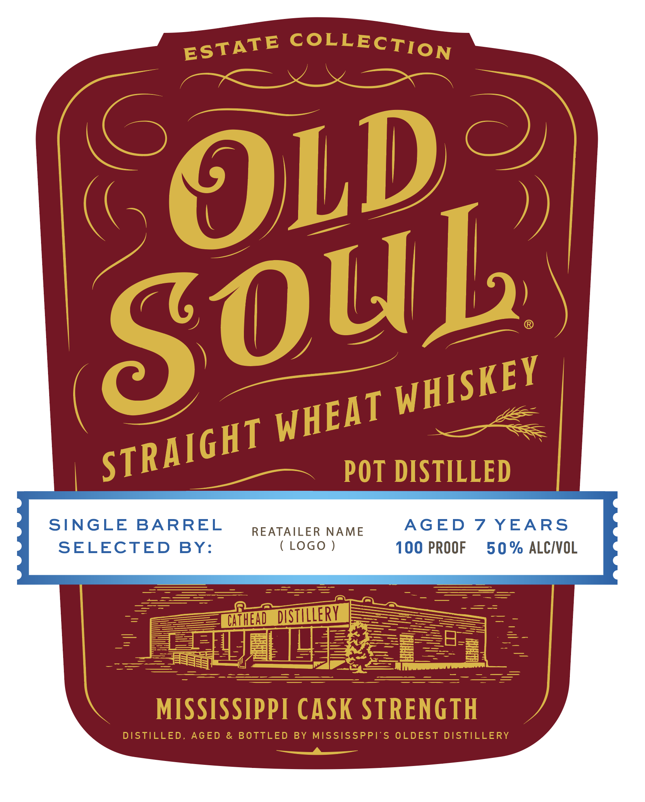

# TTB COLA Label Images - TTBID 26188001000115

**Brand Name:** OLD SOUL

**Fanciful Name:** MISSISSIPPI WHEAT

**Issue Date:** 07/22/2026

**Origin Code:** 28

**Product Class/Type:** 109

**Source:** [TTB Public COLA Registry](https://ttbonline.gov/colasonline/viewColaDetails.do?action=publicFormDisplay&ttbid=26188001000115)

## Label Images

### Back Label

### Label 1

## Extracted Label Text

*Text extracted via OCR - may contain errors*

**Detected Proof:** 110
**Detected Age:** 7 Years

### Back Label

—__y-
ESTATE COLLECTION

OLD SOUL STRAIGHT WHEAT WHISKEY
MISSISSIPPI CASK STRENGTH

AGED: 7 YEARS

LOT SIZE: 16 BARRELS

MATURED IN: AMERICAN OAK CHAR 3

ENTRY PROOF: 110
MASH BILL

100% WHEAT
GROWN IN MISSISSIPPI

NON-CHILL FILTERED
&NO COLOR ADDED wy

CATHEADDISTILLERY.COM
422 S. FARISH STREET, JACKSON, MS 39201
DISTILLED, AGED AND
BOTTLED BY:
CATHEAD DISTILLERY
JACKSON, MS-750 ML
GOVERNMENT WARNING: (1) ACCORDING TO THE SURGEON GENERAL,
WOMEN SHOULD NOT DRINK ALCOHOLIC BEVERAGES DURING
PREGNANCY BECAUSE OF THE RISK OF BIRTH DEFECTS. (2) CONSUMPTION
OF ALCOHOLIC BEVERAGES IMPAIRS YOUR ABILITY TO DRIVE A
CAR OR OPERATE MACHINERY, AND MAY CAUSE HEALTH PROBLEMS.

eSeSSSSSSSSSSSSFFSFSFSSSSM

### Label 1

COLLECTION
6
OLD
POT DISTILLED
SINGLE
BARREL
REATAILER
NAME
AGED
7
YEARS
SELECTED
BY:
LOGo
100 PROOF
50 % ALCIVOL
Wifhend dstilleRV
MISSISSIPPI CASK STRENGTH
DISTILLED,
AGED
&
BOTTLED BY MISSISSPPE'S OLDEST DISTILLERY
ESTATE
SouL
WHISKEY
WHEAT
STRAIGHT
Zee
