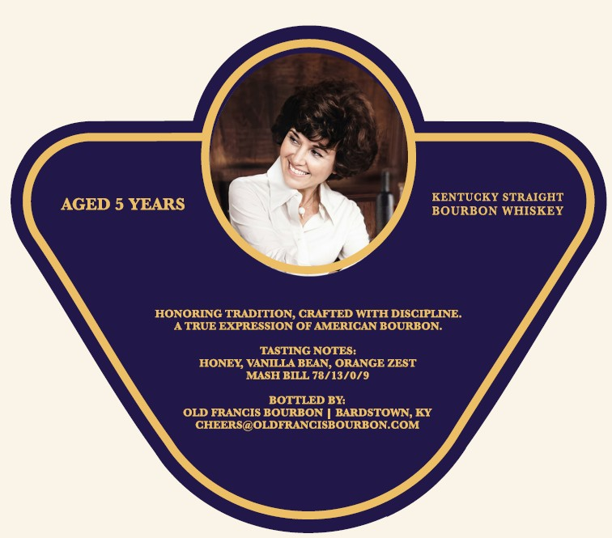
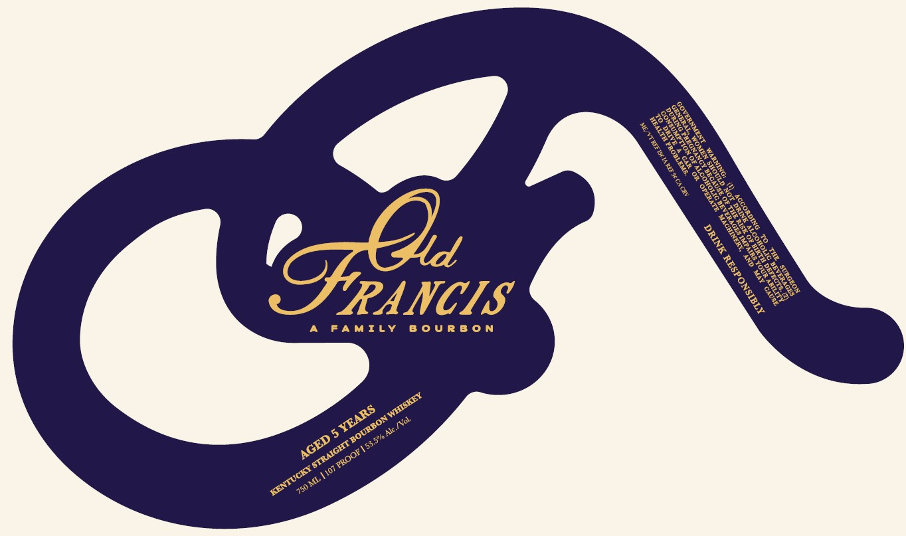

# TTB COLA Label Images - TTBID 26188001000191

**Brand Name:** OLD FRANCIS

**Issue Date:** 07/08/2026

**Origin Code:** 22

**Product Class/Type:** 101

**Source:** [TTB Public COLA Registry](https://ttbonline.gov/colasonline/viewColaDetails.do?action=publicFormDisplay&ttbid=26188001000191)

## Label Images

### Back Label

### Label 1

## Extracted Label Text

*Text extracted via OCR - may contain errors*

*1 image(s) excluded: text did not meet readability threshold*

**Detected Age:** 5 Years

### Back Label

KENTUCKY STRAIGHT
AGED 5 YEARS
BOURBON WHISKEY
HONORING TRADITION, CRAFTED WITH DISCIPLINE
ATRUE EXPRESSION OF AMERICAN BOURBON:
TASTING NOTES:
HONEY VANILLA BEAN, ORANGE ZEST
MASH BILL 78/13/0/9
BOTTLED BY:
OLD FRANCIS BOURBON
BARDSTOWN, KY
CHEERS@OLDFRANCISBOURBONCOM
