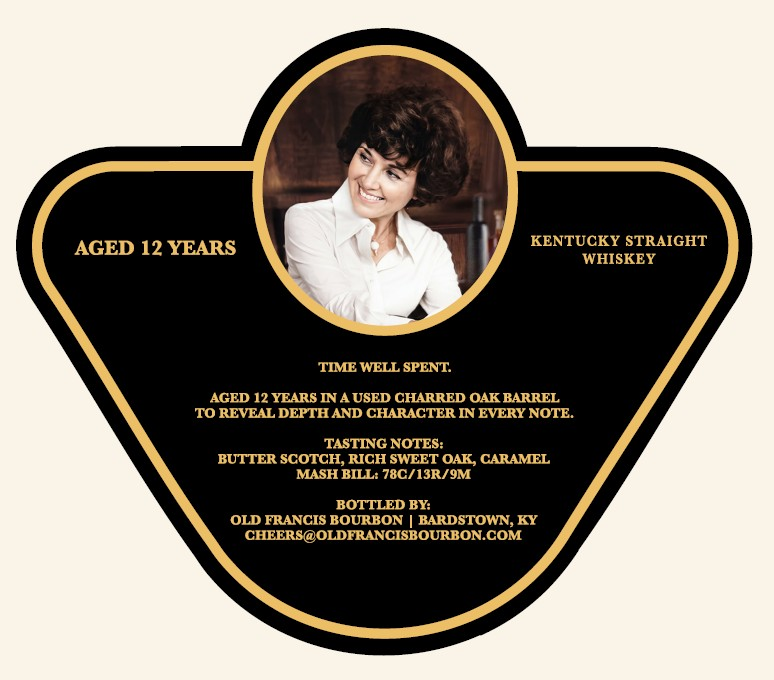
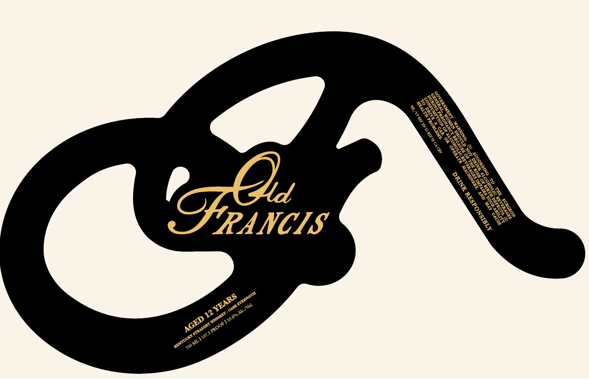

# TTB COLA Label Images - TTBID 26188001000197

**Brand Name:** OLD FRANCIS

**Issue Date:** 07/08/2026

**Origin Code:** 22

**Product Class/Type:** 109

**Source:** [TTB Public COLA Registry](https://ttbonline.gov/colasonline/viewColaDetails.do?action=publicFormDisplay&ttbid=26188001000197)

## Label Images

### Back Label

### Label 1

## Extracted Label Text

*Text extracted via OCR - may contain errors*

*1 image(s) excluded: text did not meet readability threshold*

**Detected Age:** 12 Years

### Back Label

AGED 12 YEARS
KENTUCKY STRAIGHT
WHISKEY
TIME WELL SPENT
AGED 12 YEARS IN A USED CHARRED OAK BARREL
TO REVEAL DEPTH AND CHARACTER IN EVERY NOTE_
TASTING NOTES:
BUTTER SCOTCH, RICH SWEET OAK CARAMEL
MASH BILL: 78C/13R/ 9M
BOTTLED BY:
OLD FRANCIS BOURBON
BARDSTOWN, KY
CHEERS@OLDFRANCISBOURBON.COM
