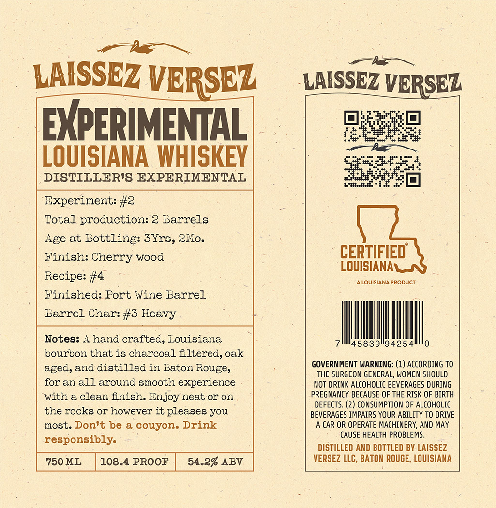

# TTB COLA Label Images - TTBID 26188001000449

**Brand Name:** LAISSEZ VERSEZ

**Fanciful Name:** EXPERIMENTAL LOUISIANA WHISKEY

**Issue Date:** 07/09/2026

**Origin Code:** 23

**Product Class/Type:** 140

**Source:** [TTB Public COLA Registry](https://ttbonline.gov/colasonline/viewColaDetails.do?action=publicFormDisplay&ttbid=26188001000449)

## Label Images

### Label 1

## Extracted Label Text

*Text extracted via OCR - may contain errors*

**Detected Proof:** 108.4
**Detected Age:** 3 Years

### Label 1

LAISSEZ VERSEZ
LAISSEZ VERSEZ
EXPERIMENAL]
LOUISIANA WHISKEY
DISTILLER'S EXPERIMENTAL
Experiment: #2
Total proauction: 2 Barrels
Age at Bottling: 3Yrs, 2Mo:
Kinish: Cherry wood
CERTIFIED
LOUISIANAL
Recipe: #4
LOUISIANA PRODUCT
Finished: Port Wine Barrel
Barrel Char: #3 Heavy
Notes:
A hand crafted; Louisiana
'45839"94254
bourbon that is charcoal fltered, oak
aged, and distilled in Baton Rouge,
GOVERNMENT WARNING: (1) ACCORDING TO
THE SURGEON GENERAL, WOMEN SHOULD
for an all around smooth experience
NOT DRINK alcoholic BEVERAGES DURING
with & clean fnish: Enjoy neat or on
PREGNANCY BECAUSE OF THE RISK OF BIRTH
DEFECTS
2) CONSUMPTION OF Alcoholic
the rocks or however it pleases you
BEVERAGES IMPAIRS YOUR ABILITY TO DRIVE
most. Don't be & couyon. Drink
A CAR OR OPERATE MACHINERY, AND MAY
CAUSE HEALTH PROBLEMS.
responsibly.
DISTILLED AND BOTTLED BY LAISSEZ
750 ML
108.4 PROOF
54.2% ABV
VERSEZ LLC, BATON ROUGE, LOUISIANA
