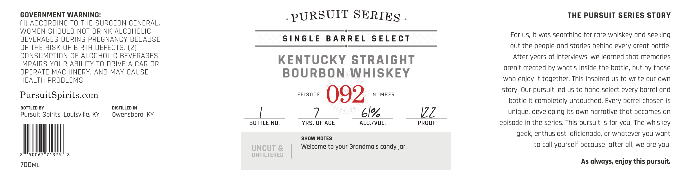
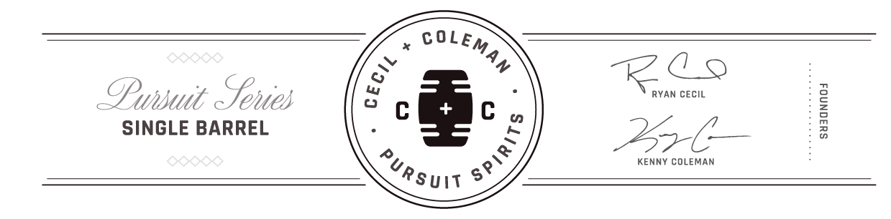

# TTB COLA Label Images - TTBID 26188001000518

**Brand Name:** PURSUIT SERIES

**Fanciful Name:** EPISODE 092

**Issue Date:** 07/08/2026

**Origin Code:** 22

**Product Class/Type:** 101

**Source:** [TTB Public COLA Registry](https://ttbonline.gov/colasonline/viewColaDetails.do?action=publicFormDisplay&ttbid=26188001000518)

## Label Images

### Label 1

### Label 2

## Extracted Label Text

*Text extracted via OCR - may contain errors*

### Label 1

GOVERNMENT WARNING:
PURSUIT SERIES
THE PUrsuit SERIES STORY
(1) ACCORDING TO THE SURGEON GENERAL,
WOMEN SHOULD NOT DRINK ALCOHOLIC
For US, it was
searching for rare whiskey and seeking
BEVERAGES DURING PREGNANCY BECAUSE
S|NGLE
B A RREL
SELECT
OF THE RISK OF BIRTH DEFECTS, (2)
out the people and stories behind every great bottle;
CONSUMPTION OF ALCOHOLIC BEVERAGES
KENTUCKY
STRAIGHT
After years of interviews; we learned that memories
IMPAIRS YOUR ABILITY TO DRIVE A CAR OR
aren't created by what's inside the bottle, but by those
OPERATE MACHINERY, AND MAY CAUSE
BOURBON
WHISKEY
HEALTH PROBLEMS,
who enjoy it together; This inspired uS to write our own
story: Our pursuit led us to hand select every barrel and
PursuitSpirits.com
EPISODE
092
NUMBER
bottle it completely untouched, Every barrel chosen is
BOTTLED BY
DISTILLED IN
Pursuit Spirits; Louisville; KY
Owensboro, KY
ble_
12Z
unique; developing its own narrative that becomes n
BOTTLE NO,
YRS
OF AGE
ALC /VOL.
PROOF
episode in the series This pursuit is for you; The whiskey
geek; enthusiast; aficionado; or whatever you wont
SHOW NOTES
UNCUT &
Welcome to your Grandma's candy jar;
to call yourself because; after all, we are you;
50067//71325
UNFILTERED
ZOOML
As always, enjoy this pursuit:
7103139

### Label 2

COLE;
Lu
RL
OPwnsuit  enies
0
RYAN CECIL
SINGLE BARREL
276
1
KENNY COLEMAN
MAN
3
1
Pursuij
