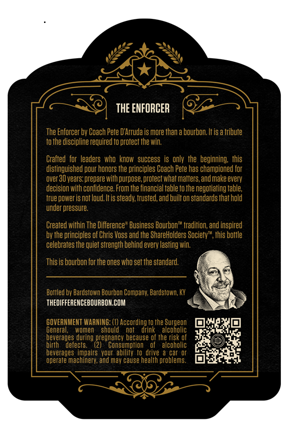
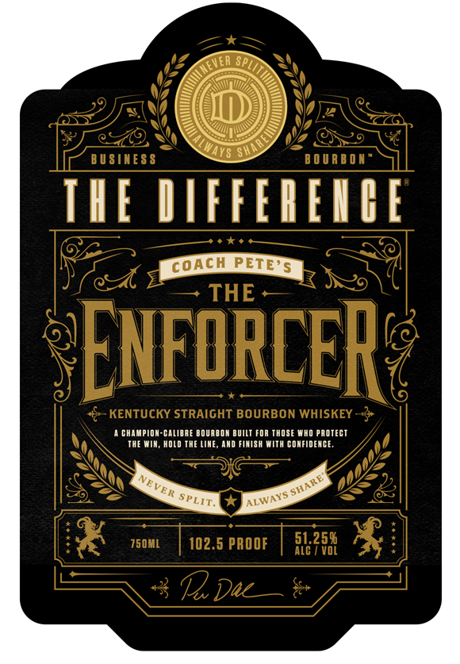

# TTB COLA Label Images - TTBID 26188001000609

**Brand Name:** THE DIFFERENCE

**Issue Date:** 07/08/2026

**Origin Code:** 22

**Product Class/Type:** 101

**Source:** [TTB Public COLA Registry](https://ttbonline.gov/colasonline/viewColaDetails.do?action=publicFormDisplay&ttbid=26188001000609)

## Label Images

### Back Label

### Front Label

### Label 3

## Extracted Label Text

*Text extracted via OCR - may contain errors*

*1 image(s) excluded: text did not meet readability threshold*

**Detected Proof:** 102.5
**Detected Age:** 30 Years

### Back Label

thE ENFORCER
The Enforcer by Coach Pete DArruda is more than a bourbon Itis a tribute
to the discipline required t0 protect the win,
Crafted  for leaders  who  know   success  is only the beginning; this
distinguished pour honors the principles Coach Pete has championed for
over 30 years: prepare with purpose; protect what matters, and make everv
decision with confidence. From the financial table to the negotiating table;
true power is not loud, It is steady; trusted,and built on standards that hold
under pressure
Created within The Difference " Business Bourbon" tradition, and inspired
by the principles of Chris Voss and the ShareHolders Society", this bottle
celebrates the quiet strength behind every lasting win;
This is bourbon for the ones who set the standard:
Bottled by Bardstown Bourbon Company; Bardstown KY
THEDIFFERENCEBOURBON COM
GOVERNMENT WARNING: (1) According to the ;
General,
women
should
nof
drink
aSconeog
beverages during
because of the risk of
birth
defects:
(2regransumhecans
alcoholic
beverages   impairs   vour  ability to drive
car Or
operate machinery; and mav Cause health problems

### Front Label

YS Sh
BU SINES $
B 0 U A B 0 H
IHE DIFFFREICE
COACH PETE'$
1
Ng
THE
Enforcehe
KENTUCKY STRAIGHT BOURBON WHISKEY
CHAUPION-CALIBRE BOURBOA BUILT FOR THOSE WAO PAOTECT
THE WIn
hOLd THE LIE
FimISH #ith CONFIDEUCE;
750ML
102.5 PROOF
58253
Vol
Dac
SHAREY
NEVER
ALWAYS:
SPLIT:
