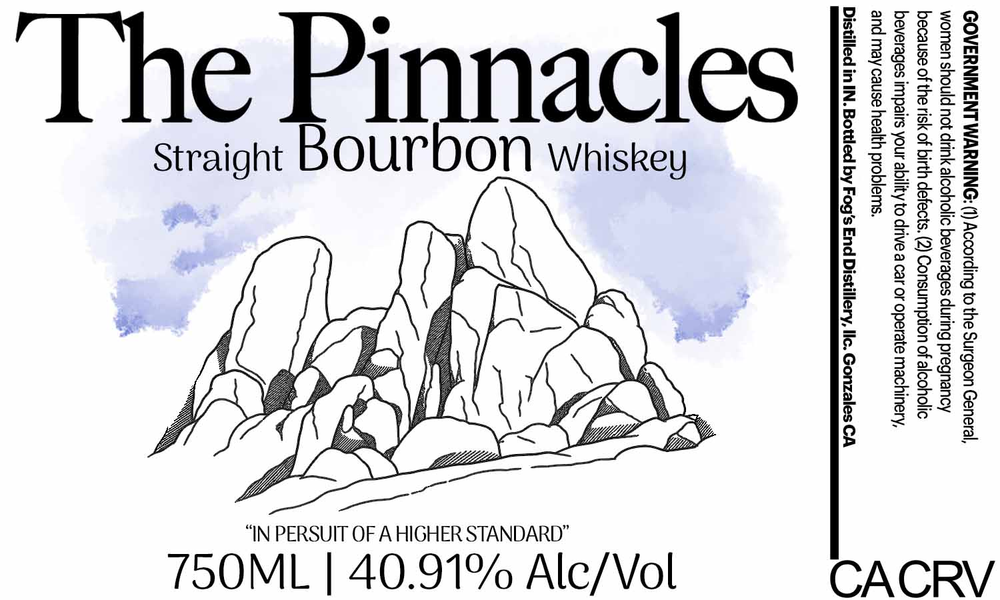

# TTB COLA Label Images - TTBID 26188001000702

**Brand Name:** THE PINNACLES

**Issue Date:** 07/13/2026

**Origin Code:** 01

**Product Class/Type:** 101

**Source:** [TTB Public COLA Registry](https://ttbonline.gov/colasonline/viewColaDetails.do?action=publicFormDisplay&ttbid=26188001000702)

## Label Images

### Label 1

## Extracted Label Text

*Text extracted via OCR - may contain errors*

**Detected Proof:** 81.8

### Label 1

GOVERNMENT WARNING: (1) According to the Surgeon General,
women should not drink alcoholic beverages during pregnancy
because of the risk of birth defects. (2) Consumption of alcoholic
beverages impairs your ability to drive a car or operate machinery,
and may cause health problems.

Distilled in IN. Bottled by Fog's End Distillery, llc. Gonzales CA

CACRV

ON Whiskey

nnacles

Straight Bour
TSOML | 40.91% Alc/Vol

The Pi
